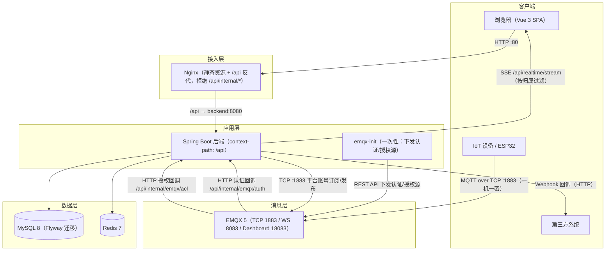

# MQTT云平台 - 系统架构文档

> 版本：v1.4　最后更新：2026-09-30
> 适用范围：`MQTT自建站点` 主项目（Spring Boot + Vue 3 + EMQX + MySQL + Redis）

---

## 1. 系统概述

本系统是一个自部署的 MQTT 物联网云平台，围绕 **EMQX Broker** 构建，提供：

- 用户认证与 RBAC 权限（ADMIN / OPERATOR / VIEWER）
- 设备管理与在线状态监控
- MQTT 消息发布、实时订阅与历史查询
- 统计分析、API Key 与 Webhook 对外集成能力

设计原则：分层解耦（Controller → Service → Mapper）、配置外置（环境变量注入）、统一响应与统一异常、默认安全（鉴权前置）。

---

## 2. 总体架构



要点：

- **实时通道收敛到后端**：浏览器不再直连 Broker，改为订阅后端 SSE（`GET /api/realtime/stream`），由后端按设备归属与角色过滤后推送，前端不再持有任何 Broker 凭据。
- **EMQX 认证与授权外置到后端**：设备连接触发 `/api/internal/emqx/auth`，主题读写触发 `/api/internal/emqx/acl`，由后端按「产品 → 设备 → 一机一密」规则裁决；`emqx-init` 服务负责把这两个回调源写入 EMQX（幂等，可重复执行）。
- **Nginx 只代理 `/api`**：前端静态资源与 SPA 回退由 Nginx 承担；`/api/internal/*` 在网关层直接返回 403，仅允许容器网络内的 EMQX 直连后端。

---

## 3. 部署拓扑与端口

| 服务 | 镜像 | 容器名 | 宿主端口 | 说明 |
|------|------|--------|----------|------|
| MySQL | `mysql:8.0` | `mqtt-mysql` | 3306 | 业务数据；schema 由 Flyway 迁移管理（`db/migration/V*.sql`） |
| Redis | `redis:7-alpine` | `mqtt-redis` | 6379 | Token 黑名单、设备在线状态缓存 |
| EMQX | `emqx/emqx:5.0` | `mqtt-emqx` | 1883 / 8083 / 18083 | MQTT TCP / MQTT WebSocket / 管理后台 |
| EMQX 初始化 | `curlimages/curl:8.8.0` | `mqtt-emqx-init` | — | 一次性：通过 REST API 下发 HTTP 认证与授权源（`restart: "no"`） |
| 后端 | `mqtt-cloud-backend:1.0.0` | `mqtt-backend` | 8080 | Spring Boot，健康检查 `/api/health` |
| 前端 | `mqtt-cloud-frontend:1.0.0` | `mqtt-frontend` | 80 | Nginx 托管 SPA，健康检查 `/health` |

- 编排文件：`docker/docker-compose.yml`；网络：`mqtt-network`（bridge）；命名卷：`mysql_data` / `redis_data` / `emqx_data` / `emqx_log`。
- 启动依赖：`backend` 依赖 `mysql`/`redis`/`emqx` 均为 `service_healthy`；`emqx-init` 依赖 `emqx` 与 `backend` 为 `service_healthy`；`frontend` 依赖 `backend` 为 `service_healthy`。
- **环境变量注意**：compose 文件位于 `docker/`，而 `.env` 位于仓库根目录，执行时需显式 `--env-file .env`（详见 `docs/DEPLOYMENT.md`）。

---

## 4. 后端架构

### 4.1 分层结构

> 以下分层依赖由 ArchUnit 规则强制（`backend/src/test/java/com/mqtt/cloud/arch/LayeringRulesTest.java`），
> 违反会在 `mvn test` 阶段失败；逻辑模块划分见 [4.4 目标模块边界](#44-目标模块边界)。

```
com.mqtt.cloud
├── controller/     # 13 个控制器（含 internal/ 的 EMQX 回调），仅做参数校验与编排，统一返回 Result<T>
├── service/        # 业务接口 + impl/ 实现，事务边界所在
├── mapper/         # MyBatis-Plus Mapper（注解 SQL + Wrapper）
├── entity/         # 与表一一对应的实体（含 Product、Device）
├── dto/
│   ├── request/    # 入参对象（@Valid 校验）
│   └── response/   # 出参对象（不直接暴露 entity；DeviceCreatedDTO 承载一次性明文密钥）
├── mqtt/           # MqttClientManager / MqttMessageHandler / MqttProperties
├── filter/         # JwtAuthenticationFilter / ApiKeyAuthFilter / InternalTokenFilter / UserPrincipal
├── config/         # Security / Redis / MyBatis-Plus / OpenAPI / Async / Schedule / RestTemplate / AccessControl / Realtime
├── common/         # Result / ResultCode / exception / security / constant
└── util/           # JwtUtil / ApiKeyGenerator
```

### 4.2 控制器清单

| 控制器 | 前缀 | 职责 |
|--------|------|------|
| `AuthController` | `/auth` | 注册、登录、登出、当前用户、修改密码 |
| `DeviceController` | `/devices` | 设备 CRUD、状态查询、在线列表、禁用/启用（`enabled`，归属校验）、下发指令 |
| `MessageController` | `/messages` | 发布消息、最近消息 |
| `HistoryController` | `/history` | 按设备/时间/Topic 分页查询历史 |
| `AnalyticsController` | `/analytics` | 消息量趋势等统计 |
| `ApiKeyController` | `/api-keys` | API Key 的签发与吊销 |
| `WebhookController` | `/webhooks` | Webhook 配置 CRUD |
| `ExternalApiController` | `/external/v1` | 面向第三方的 API Key 鉴权接口 |
| `HealthController` | `/health` | 健康检查 |
| `ProductController` | `/products` | 产品（设备类型模板）CRUD、停用/启用（`status`，ADMIN）；删除时校验产品下是否仍有设备 |
| `RealtimeController` | `/realtime` | SSE 实时数据流（按设备归属与角色过滤） |
| `EmqxAuthController` | `/internal/emqx` | EMQX HTTP 认证回调（内部，须 `X-Internal-Token`） |
| `EmqxAclController` | `/internal/emqx` | EMQX HTTP 授权回调（内部，须 `X-Internal-Token`） |

Swagger 分组共 11 组（认证 / 产品 / 设备 / 消息 / 历史 / 统计 / API密钥 / Webhook / 外部API / 实时数据 / 健康检查），访问 `/api/swagger-ui.html`；`/internal/**` 为容器内部回调，不纳入 Swagger。

### 4.3 关键组件

- **`MqttClientManager`**：应用启动时按 `spring.mqtt.*` 建立到 EMQX 的 TCP 长连接，负责订阅通配 Topic 与发布下发指令。订阅使用 EMQX 共享订阅（`$share/{group}/device/+/...`），多副本同组分摊消息，避免每条上行被所有副本重复落库。
- **`MqttMessageHandler`**：消息回调入口，解析 payload → 落 `message` 表 → 更新设备在线状态 → 触发 Webhook 分发。
- **`DeviceMonitorService`**：定时任务（`ScheduleConfig` 启用），根据最近心跳时间判定设备在线/离线并写 `device_status_history`。
- **`WebhookDispatcher`**：基于 `RestTemplate`（`RestTemplateConfig`）向已配置 URL 推送事件。
- **`TokenBlacklistService`**：登出后把 Token 写入 Redis 黑名单，`JwtAuthenticationFilter` 据此拒绝已登出 Token。
- **`AsyncConfig`**：为落库/通知等旁路逻辑提供线程池，避免阻塞 MQTT 回调线程。
- **`DeviceSecretService`**：一机一密凭据的生成 / 哈希 / 校验（BCrypt），并负责 `{productKey}.{deviceKey}` 用户名的拼装解析与平台账号 `PLATFORM` 的识别。
- **`DeviceAccessGuard`**：认证回调与授权回调**共用的准入判定入口**——`resolve` 缓存优先解析产品 / 设备元数据（未命中回源查库并回填，否定结果不缓存），`isPermitted` 要求产品 `ENABLED` 且设备 `enabled=1`。两个回调只有一处判定，避免「认证拒绝连接、授权放行收发」的语义分叉。
- **`EmqxAuthService`**：EMQX 连接认证裁决——经 `DeviceAccessGuard` 判定准入后校验密钥哈希；`ACCESS_CONTROL_ENFORCE_AUTH=false` 时一律放行（迁移期双轨）。
- **`AclEvaluator`**：主题级授权裁决——设备先经 `DeviceAccessGuard` 判定准入（禁用 / 停用后已连接会话的收发同样被拒），再校验主题：设备只能读写自己 `device/{deviceKey}/**` 且禁止发布到自身 `cmd/`；平台账号可订阅全部设备主题、仅可发布 `cmd/`；未匹配默认拒绝。
- **`RealtimeStreamService`**：维护 SSE 订阅者，按设备 `ownerId` 与用户角色过滤后推送，替代前端直连 Broker。
- **`InternalTokenFilter`**：校验 `/internal/**` 的 `X-Internal-Token` 请求头，防止 EMQX 回调接口被外部调用（用 `getServletPath()` 判断，避免 context-path 干扰）。

### 4.4 目标模块边界

分层的「技术维度」之外，后端按业务能力划分为四个**逻辑模块**。当前仍为单 Maven 模块，
边界由 ArchUnit 在测试期强制；**物理拆分推迟到触发条件满足时**（后端代码 > 2 万行，
或某逻辑模块需独立部署/伸缩），以避免无独立部署收益时徒增构建与调试成本。

| 逻辑模块 | 现有包 | 职责 |
|---------|-------|------|
| `ingest` | `ingest`、`mqtt` | 接入摄取、批量落库、分发 |
| `device` | `entity.Device` / `entity.Product`、`service.Device*` / `Product*`、`controller.Device*` / `Product*` | 设备与身份 |
| `telemetry` | `entity.Message` / `HistoryRecord`、`service.Message*` / `History*`、`controller.Message*` / `History*` / `Analytics*` | 遥测写入与查询 |
| `platform` | `service.User*` / `ApiKey*` / `TokenBlacklist*`、`controller.Auth*` / `ApiKey*`、`filter`、`config` | 认证、API Key、Webhook 等平台能力 |

**可执行边界**（`backend/src/test/java/com/mqtt/cloud/arch/LayeringRulesTest.java`）

| 规则 | 含义 |
|------|------|
| 分层依赖单向 | `Controller → Service → Mapper`；Mapper 不得访问 Service，任何层不得访问 Controller；**同层互调允许**（Service 之间编排是常规形态） |
| 摄取层不得依赖控制层 | `ingest` 不感知 HTTP 层 |
| 回调线程所在包不得直接依赖 Mapper | `mqtt` 回调只做解析与投递，落库交给 `ingest` —— P0-1 的结构性防线 |
| 服务接口包不得直接依赖 Mapper | 持久化细节只出现在 `service.impl`，防止 `getBaseMapper()` 之类的"借道"泄漏到接口包 |

> 规则失败只允许两种处理：修正越界代码，或调整规则使其反映真实架构；**不得用 `@ArchIgnore` 绕过**。

---

## 5. 前端架构

### 5.1 目录与职责

```
frontend/src
├── api/          # axios 实例与按域拆分的接口封装（auth/device/message/history/stats）
├── stores/       # Pinia：auth（令牌与用户）、device（设备列表与在线态）
├── router/       # Vue Router，含登录态守卫
├── components/   # Icon.vue（SVG 精灵）、Layout/MainLayout.vue、Layout/Sidebar.vue
├── views/        # landing / auth / dashboard / device / message / history / api
├── assets/       # css 设计令牌 + svg/icons 图标库
└── utils/        # echarts 按需封装
```

### 5.2 数据流

- **请求类**：组件 → `api/*.js` → `api/axios.js`（统一 baseURL `/api`、注入 `Authorization`、统一错误提示）→ 后端。
- **实时类**：`views/message/MessageMonitor.vue` 调用 `api/realtime.js` 的 `subscribeRealtime()`，以 `fetch` 流式读取 `GET /api/realtime/stream`（SSE，携带 `Authorization`），解析 `data:` 帧后渲染；卸载时通过 `AbortController` 释放连接。
- **图表类**：`utils/echarts.js` 按需引入 ECharts，用于统计页。

> 前端不再依赖 `mqtt.js`，也不再持有任何 Broker 账号：实时数据一律经后端 SSE 通道下发。

### 5.3 构建优化

- **Element Plus 按需引入**：不使用官方 `ElementPlusResolver`（它在 element-plus ≥1.1.0-beta.1 下会硬编码回退到 barrel 入口 `element-plus/es`，从而把全部组件与 `makeInstaller([...])` 一起拉入依赖图）。改为在 `vite.config.js` 内实现细粒度 resolver `ElementPlusOnDemand()`，把 `<el-*>` 标签与命令式 API 直接指向 `element-plus/es/components/<dir>/index.mjs`，并按需注入 `element-plus/es/components/base/style/css` 与 `element-plus/es/components/<dir>/style/css` 副作用样式。目录别名归并：`option`/`option-group` → `select`、`menu-item`/`sub-menu` → `menu`、`dropdown-item`/`dropdown-menu` → `dropdown`。
- **样式引入**：命令式 API（`ElMessage` / `ElMessageBox`）由 `unplugin-auto-import` 经同一 resolver 注入，样式随 `style/css` 副作用一并打包；应用未使用 `v-loading` / `ElNotification` / `ElLoading`，故不注入其样式。
- **图标按需**：`main.js` 仅注册模板中实际使用的图标（当前仅 `ArrowDown`），替代原先 `import * as ElementPlusIconsVue`（整包约 230KB）。
- **效果（构建产物）**：`element-plus` chunk 由 949.03 kB（gzip 292.31 kB）降至 170.62 kB（gzip 55.41 kB），保留组件目录由 99 个收敛至 27 个。
- **Node 版本要求**：`unplugin@3.x` 声明 `engines.node: ^20.19.0 || >=22.12.0`，因此 `frontend/package.json` 声明 `engines.node >=20.19.0`，前端镜像构建阶段基础镜像为 `node:22-alpine`。
- `manualChunks` 拆分 vendor，入口 chunk 已从 1.25MB 降至约 63KB。
- 运行时配置通过 `VITE_` 前缀变量在构建期注入（Vite 仅暴露该前缀变量）。
- **开发代理**：dev server 的 `/api` 代理使用正则键 `'^/api/'` 精确匹配，避免把 SPA 路由 `/api-docs` 一并转发到后端；目标地址默认 `http://localhost:8080`，可用 `VITE_DEV_PROXY_TARGET` 覆盖（例如后端未映射宿主机端口时指向 nginx `http://localhost:80`）。

---

## 6. 数据模型

| 表 | 说明 |
|----|------|
| `sys_user` | 用户与角色（ADMIN/OPERATOR/VIEWER）、BCrypt 密码 |
| `product` | 产品（设备类型模板）：`product_key`、认证方式、Topic 模板、载荷格式、状态 |
| `device` | 设备档案（所属产品、名称、Topic、所属用户、一机一密密钥哈希、连接许可 `enabled`、最近心跳） |
| `device_status_history` | 设备在线状态变更流水 |
| `message` | 设备上报/平台发布的消息 |
| `history_record` | 历史查询用归档记录 |
| `api_key` | 第三方接入密钥（哈希存储） |
| `webhook_config` | Webhook 目标地址与事件订阅 |

三层关系：**产品（模板）→ 设备（实例，`deviceKey` 在产品内唯一）→ 凭据（`deviceSecret` 仅存 BCrypt 哈希于 `device`）**。

Schema 由 **Flyway** 管理：`backend/src/main/resources/db/migration/V1__baseline.sql`（基线）与 `V2__product_and_device_identity.sql`（产品表 + 设备表改造）。存量库通过 `baseline-on-migrate` 记为 V1 后仅执行 V2+。字段级设计与索引见 `docs/T-01_数据库设计与Schema初始化_开发文档.md`。

---

## 7. 安全设计

- **认证方式**
  - 管理面：JWT（`JwtUtil` 签发，`JwtAuthenticationFilter` 校验），登出走 Redis 黑名单。
  - 开放面：API Key（`ApiKeyAuthFilter` 校验，`ApiKeyGenerator` 生成），仅放行 `/api/external/v1/**`。
  - 设备面：一机一密。设备以 `{productKey}.{deviceKey}` 为用户名、`deviceSecret` 为密码连接 EMQX，EMQX 回调 `/api/internal/emqx/auth` 由后端裁决；密钥仅存 BCrypt 哈希，明文只在创建设备/重置密钥时返回一次。
- **授权模型**
  - 管理面：基于角色的 RBAC，`SecurityConfig` 声明各路径所需角色，`@PreAuthorize` 做方法级细化（`@EnableMethodSecurity`）。
  - 设备面：主题级 ACL，EMQX 回调 `/api/internal/emqx/acl`，由 `AclEvaluator` 按「设备只能读写自身 `device/{deviceKey}/**`、平台账号可订阅全量且仅可发布 `cmd/`」裁决，未匹配默认拒绝。
- **内部接口防护**：`/internal/**` 在 Spring Security 放行后由 `InternalTokenFilter` 校验 `X-Internal-Token`；网关侧 Nginx 对 `/api/internal/` 直接返回 403，仅容器网络内的 EMQX 可直连后端。
- **实时数据隔离**：SSE 通道按设备 `ownerId` 与用户角色过滤，前端不再持有 Broker 凭据，避免越权订阅全量 Topic。
- **错误码精确化**：过滤器把具体失败原因（如 Token 失效 / Token 过期 / API Key 无效）写入请求属性，由 `RestSecurityExceptionHandler` 映射为对应 `ResultCode`，避免一律返回笼统 401。
- **统一出口**：`GlobalExceptionHandler` 收敛 `BusinessException` 与参数校验异常，统一为 `Result<T>` 结构。
- **密钥管理**：`JWT_SECRET` / `INTERNAL_TOKEN` / `PLATFORM_SECRET` 均由 `.env` 提供（compose 使用 `:?` 强校验），`scripts/deploy.sh` 会在缺失或仍为占位值时自动生成；`.env` 与 `*.pem/*.key` 已在 `.dockerignore` 中排除，避免进入镜像。

---

## 8. 外部依赖与配置

| 依赖 | 配置项（环境变量） | 默认值 |
|------|-------------------|--------|
| MySQL | `DB_HOST`/`DB_PORT`/`DB_USERNAME`/`DB_PASSWORD`/`DB_NAME` | localhost:3306 / root / root_password / mqtt_cloud |
| Redis | `REDIS_HOST`/`REDIS_PORT`/`REDIS_PASSWORD` | localhost:6379 |
| EMQX | `MQTT_HOST`（须为 `tcp://host:port`）/`MQTT_USERNAME`（固定 `PLATFORM`）/`MQTT_PASSWORD`（取 `PLATFORM_SECRET`） | tcp://localhost:1883 / PLATFORM / 无默认 |
| 接入访问控制 | `INTERNAL_TOKEN` / `PLATFORM_SECRET` / `FRONTEND_SECRET` | 无默认，必须显式配置（`deploy.sh` 自动生成） |
| 迁移期开关 | `ACCESS_CONTROL_ENFORCE_AUTH`（false=双轨放行）/ `DIRECT_FRONTEND_ENABLED` / `STREAM_TIMEOUT_MS` | false / true / 0 |
| 服务 | `SERVER_PORT` | 8080 |
| 安全 | `JWT_SECRET` | 无默认，必须显式配置 |

配置集中定义于 `backend/src/main/resources/application.yml` 与根目录 `.env.example`。

---

## 9. 非功能性设计

- **性能**：HikariCP 连接池（最大 20）、Redis Lettuce 池化、MQTT 批量/异步处理；前端按需引入与分包；后端镜像多阶段构建（448MB）、前端镜像 97.4MB。
- **可观测**：SLF4J + Logback 分级日志；`/api/health` 供容器健康检查；Spring Boot Actuator 提供运行时指标——`/actuator/health`、`/actuator/prometheus` 公开，`/actuator/info`、`/actuator/metrics` 仅 ADMIN（见 `SecurityConfig`），Prometheus 抓取指标由 `micrometer-registry-prometheus` 输出；EMQX Dashboard 观察连接与吞吐。
- **可扩展**：新增设备类型仅需扩展 `device` 表字段与对应 Service；新增 MQTT Topic 在配置侧注册；新增页面在 `router` 注册并复用 Layout；对接第三方通过 Webhook 或 `/api/external/v1`。
- **多副本与消息顺序**：上行订阅采用 EMQX 共享订阅（`$share/{group}/device/+/data` 等），多副本同组按 `round_robin`（EMQX 默认策略）分摊消息，**不保证同一设备消息跨副本的到达顺序**；设备状态的正确性由 `updateStatusGuarded` 的时间戳守卫保证（乱序旧事件被丢弃，R1-6）。若业务需要严格单设备有序，须在 R5 引入按 `deviceKey` 分区的消息队列（如 Kafka）。
- **数据持久化**：全部状态数据落在命名卷，`docker compose down`（不带 `-v`）不丢数据。

---

## 10. 相关文档

- 部署与运维：[`docs/DEPLOYMENT.md`](DEPLOYMENT.md)
- 数据库设计：[`docs/T-01_数据库设计与Schema初始化_开发文档.md`](T-01_数据库设计与Schema初始化_开发文档.md)
- 后端各模块：[`docs/T-02`](T-02_后端项目基础架构搭建_开发文档.md) ~ [`docs/T-05`](T-05_后端消息管理与历史查询_开发文档.md)
- 前端各模块：[`docs/T-06`](T-06_前端项目基础架构与设计系统_开发文档.md) ~ [`docs/T-08`](T-08_前端实时消息与历史页面_开发文档.md)
- 集成测试：[`docs/T-09_API集成与端到端测试_开发文档.md`](T-09_API集成与端到端测试_开发文档.md)
- 设备接入：[`docs/ESP32_接入手册.md`](ESP32_接入手册.md)