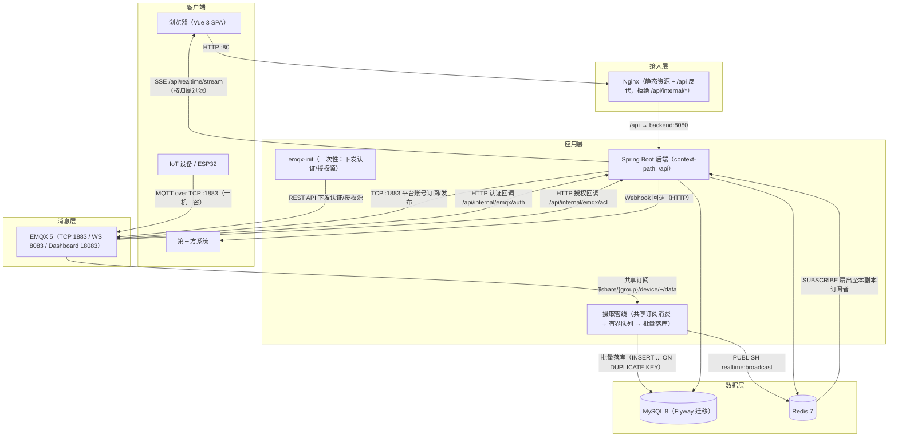

# MQTT云平台 - 系统架构文档

> 版本：v1.13　最后更新：2026-10-03
> 适用范围：`MQTT自建站点` 主项目（Spring Boot + Vue 3 + EMQX + MySQL + Redis）

---

## 1. 系统概述

本系统是一个自部署的 MQTT 物联网云平台，围绕 **EMQX Broker** 构建，提供：

- 用户认证与 RBAC 权限（ADMIN / OPERATOR / VIEWER）
- 设备管理与在线状态监控
- MQTT 消息发布、实时订阅与历史查询
- 统计分析、API Key 与 Webhook 对外集成能力

设计原则：分层解耦（Controller → Service → Mapper）、配置外置（环境变量注入）、统一响应与统一异常、默认安全（鉴权前置）。

---

## 2. 总体架构



要点：

- **实时通道收敛到后端**：浏览器不再直连 Broker，改为订阅后端 SSE（`GET /api/realtime/stream`），由后端按设备归属与角色过滤后推送，前端不再持有任何 Broker 凭据。
- **EMQX 认证与授权外置到后端**：设备连接触发 `/api/internal/emqx/auth`，主题读写触发 `/api/internal/emqx/acl`，由后端按「产品 → 设备 → 一机一密」规则裁决；`emqx-init` 服务负责把这两个回调源写入 EMQX（幂等，可重复执行）。
- **Nginx 只代理 `/api`**：前端静态资源与 SPA 回退由 Nginx 承担；`/api/internal/*` 在网关层直接返回 403，仅允许容器网络内的 EMQX 直连后端。
- **摄取链路（R2-1~R2-3）**：平台以共享订阅 `$share/{group}/device/+/data` 消费设备上行数据，进入有界队列后由固定 worker 批量落库；同一份数据同时 `PUBLISH` 到 Redis Pub/Sub 频道，由各后端副本 `SUBSCRIBE` 后扇出给本副本持有的 SSE 连接。队列满或落库持续失败的消息进入 `ingest_dead_letter` 表待人工处置，不阻塞主链路。
- **下行命令链路（T-15）**：控制台 / 开放 API 下发命令 → 按物模型校验 → 落 `device_command_record`（`PENDING`）→ 平台账号发布到 `device/{deviceKey}/cmd/down`（QoS 1，置 `SENT`）→ 设备回执发布到 `device/{deviceKey}/reply` → 平台以共享订阅 `$share/{group}/device/+/reply` 消费，经摄取**第四路旁路**更新记录状态（`ACKED`/`FAILED`）。同步调用通过**轮询命令记录表**等待终态（跨副本正确），超时与长期停留由 `CommandTimeoutSweeper` 兜底置 `TIMEOUT`。
- **摘要指标优先**：设备最新状态与消息计数走 `updateStatusGuarded` 时间戳守卫写入，避免共享订阅 `round_robin` 分摊导致的乱序覆盖；严格有序场景留待 R5 引入 Kafka 按 `deviceKey` 分区解决。

---

## 3. 部署拓扑与端口

| 服务 | 镜像 | 容器名 | 宿主端口 | 说明 |
|------|------|--------|----------|------|
| MySQL | `mysql:8.0` | `mqtt-mysql` | 3306 | 业务数据；schema 由 Flyway 迁移管理（`db/migration/V*.sql`） |
| Redis | `redis:7-alpine` | `mqtt-redis` | 6379 | Token 黑名单、设备在线状态缓存 |
| EMQX | `emqx/emqx:5.0.26` | `mqtt-emqx` | 1883 / 8083 / 18083 | MQTT TCP / MQTT WebSocket / 管理后台（须带补丁号，Docker Hub 无 `5.0` 标签） |
| EMQX 初始化 | `curlimages/curl:8.8.0` | `mqtt-emqx-init` | — | 一次性：通过 REST API 下发 HTTP 认证与授权源（`restart: "no"`） |
| 后端 | `mqtt-cloud-backend:1.0.0` | `mqtt-backend` | 8080 | Spring Boot，健康检查 `/api/health` |
| 前端 | `mqtt-cloud-frontend:1.0.0` | `mqtt-frontend` | 80 | Nginx 托管 SPA，健康检查 `/health` |

- 编排文件：`docker/docker-compose.yml`；网络：`mqtt-network`（bridge）；命名卷：`mysql_data` / `redis_data` / `emqx_data` / `emqx_log`。
- 启动依赖：`backend` 依赖 `mysql`/`redis`/`emqx` 均为 `service_healthy`；`emqx-init` 依赖 `emqx` 与 `backend` 为 `service_healthy`；`frontend` 依赖 `backend` 为 `service_healthy`。
- **环境变量注意**：compose 文件位于 `docker/`，而 `.env` 位于仓库根目录，执行时需显式 `--env-file .env`（详见 `docs/DEPLOYMENT.md`）。

---

## 4. 后端架构

### 4.1 分层结构

> 以下分层依赖由 ArchUnit 规则强制（`backend/src/test/java/com/mqtt/cloud/arch/LayeringRulesTest.java`），
> 违反会在 `mvn test` 阶段失败；逻辑模块划分见 [4.4 目标模块边界](#44-目标模块边界)。

```
com.mqtt.cloud
├── controller/     # 18 个控制器（含 internal/ 的 EMQX 回调），仅做参数校验与编排，统一返回 Result<T>
├── service/        # 业务接口 + impl/ 实现，事务边界所在
├── mapper/         # MyBatis-Plus Mapper（注解 SQL + Wrapper）
├── entity/         # 与表一一对应的实体（含 Product、Device）
├── dto/
│   ├── request/    # 入参对象（@Valid 校验）
│   └── response/   # 出参对象（不直接暴露 entity；DeviceCreatedDTO 承载一次性明文密钥）
├── mqtt/           # MqttClientManager / MqttMessageHandler / MqttProperties
├── filter/         # JwtAuthenticationFilter / ApiKeyAuthFilter / InternalTokenFilter / UserPrincipal
├── config/         # Security / Redis / MyBatis-Plus / OpenAPI / Async / Schedule / RestTemplate / AccessControl / Realtime
├── common/         # Result / ResultCode / exception / security / constant
└── util/           # JwtUtil / ApiKeyGenerator
```

### 4.2 控制器清单

| 控制器 | 前缀 | 职责 |
|--------|------|------|
| `AuthController` | `/auth` | 注册、登录、登出、当前用户、修改密码 |
| `DeviceController` | `/devices` | 设备 CRUD、状态查询、在线列表、禁用/启用（`enabled`，归属校验）；命令能力查询 / 下发 / 命令记录分页（T-15，归属校验 + `DeviceAccessGuard` 准入）；影子查询（`GET .../shadow`）与期望值写入（`PUT .../shadow/desired`，T-16）；列表支持 `groupId`（含子分组）/ `tagId` 过滤并装配分组 / 标签摘要（T-18） |
| `MessageController` | `/messages` | 发布消息、最近消息 |
| `HistoryController` | `/history` | 按设备/时间/Topic 分页查询历史 |
| `AnalyticsController` | `/analytics` | 消息量趋势等统计 |
| `ApiKeyController` | `/api-keys` | API Key 的签发与吊销 |
| `WebhookController` | `/webhooks` | Webhook 配置 CRUD |
| `ExternalApiController` | `/external/v1` | 面向第三方的 API Key 鉴权接口；命令下发（`type/identifier/params/callType` 结构化契约，`source=OPEN_API`）与命令记录分页（T-15）、影子查询与期望值写入（T-16，`/external/v1/devices/{deviceKey}/shadow[/desired]`）、告警只读查询（T-17：`/external/v1/alerts`、`/alerts/{id}`、`/alerts/unread-count`、`/alerts/rules`） |
| `HealthController` | `/health` | 健康检查 |
| `ProductController` | `/products` | 产品（设备类型模板）CRUD、停用/启用（`status`，ADMIN）；删除时校验产品下是否仍有设备；物模型（TSL）查询 / 保存 / 清空 / 校验 / 导出 / 导入六端点（写操作 ADMIN） |
| `RealtimeController` | `/realtime` | SSE 实时数据流（按设备归属与角色过滤） |
| `EmqxAuthController` | `/internal/emqx` | EMQX HTTP 认证回调（内部，须 `X-Internal-Token`） |
| `EmqxAclController` | `/internal/emqx` | EMQX HTTP 授权回调（内部，须 `X-Internal-Token`） |
| `AlertController` | `/alerts` | 告警中心控制台（T-17）：规则 CRUD（`/alerts/rules`，按 `sourceType`/`enabled` 过滤）、告警记录分页与详情、确认（`/ack`）与人工恢复（`/recover`）、未读数（`/unread-count`）与最近活动告警（`/recent`），全部按登录用户隔离 |
| `DeviceGroupController` | `/device-groups` | 设备分组控制台（T-18）：分组树（含 `children`/`deviceCount`）/ 平铺列表 / 创建 / 详情 / 更新（重命名 / 描述 / 排序 / 移动父节点）/ 删除（仅空分组）/ 分组内设备分页（含后代）/ 单台或批量加入与移出，全部按登录用户隔离、越权 `403` |
| `DeviceTagController` | `/device-tags` | 设备标签控制台（T-18）：标签列表 / 创建 / 详情 / 更新 / 删除（自动解除关联）/ 标签内设备分页 / 单台或批量打标与去标，全部按登录用户隔离、越权 `403` |
| `DeviceBatchController` | `/devices/batch` | 设备批量操作（T-18）：批量下发命令（强制异步，逐台隔离）/ 批量启用 / 批量禁用（含踢线）/ 批量加入或移出分组 / 批量打标或去标；目标集合由「手选设备 ∪ 分组（含子分组）∪ 标签」去重并按用户二次过滤 |
| `RuleController` | `/rules` | 消息规则控制台（T-19）：规则 CRUD / 启停 / 分页（按 `sourceType`/`actionType`/`enabled`/`keyword` 过滤）/ **试运行干跑**（不落执行记录、不发送、不更冷却）/ 执行记录分页与详情 / 手动重试；`GET /rules/executions` 静态段置于 `GET /rules/{id}` 之前，规则与执行记录按登录用户隔离、越权 `403` |

Swagger 分组共 16 组（认证 / 产品 / 设备 / 消息 / 历史 / 统计 / API密钥 / Webhook / 外部API / 实时数据 / 健康检查 / 告警中心 / 设备分组 / 设备标签 / 设备批量操作 / 消息规则），访问 `/api/swagger-ui.html`；`/internal/**` 为容器内部回调，不纳入 Swagger。

### 4.3 关键组件

- **`MqttClientManager`**：应用启动时按 `spring.mqtt.*` 建立到 EMQX 的 TCP 长连接，负责订阅通配 Topic 与发布下发指令。订阅使用 EMQX 共享订阅（`$share/{group}/device/+/...`），多副本同组分摊消息，避免每条上行被所有副本重复落库。
- **`MqttMessageHandler`**：消息回调入口，解析 payload → 落 `message` 表 → 更新设备在线状态 → 触发 Webhook 分发。
- **`IngestDispatcher`**：落库事务提交后 fan-out 五路——Webhook / SSE / **物模型解析**（T-14）/ **命令回执**（T-15）/ **影子补发**（T-16，`ShadowDeliveryService.onIngest`）；解析、回执与补发均为旁路，逐条隔离失败，不影响主摄取链路。
- **`ThingModelService`**：物模型（TSL）的校验 / 存储 / 导入导出，保存即版本号 +1 并失效**本副本**缓存；`getForProduct` 供解析链路与命令校验（T-15）、设备影子（T-16）复用。
- **`ThingModelValidator`**：纯函数式 TSL 校验（V1~V16：schemaVersion、标识符规范、数据类型约束、递归深度与数量上限），返回 `{path, message}` 列表，JSON 解析失败单独归类（错误码 6101）。
- **`ThingModelCache`**：物模型定义的进程内缓存（TTL + 主动失效），避免解析热路径频繁查库；**多副本收敛窗口 = TTL**（默认 60s，`THING_MODEL_CACHE_TTL_SECONDS` 可调，0 关闭）。
- **`ThingModelInterpretService`**：上行 Alink JSON 解析——按物模型把属性 upsert 到 `device_property_latest`（保留最新一条）、事件追加到 `device_event_record`；属性值按 `dataType` 校验与文本化，非法值跳过并计数；未建模 / 非 Alink 载荷兼容直存，不丢消息。解析完成后以**内部旁路**调用告警评估（T-17 `AlertEvaluationService`）与规则评估（T-19 `RuleEvaluationService`，`onProperties` / `onEvents`），二者均逐条 try-catch 隔离、异常不冒泡到摄取链路（**不新增 `IngestDispatcher` fan-out 路**）。
- **`DeviceDataService`**：设备属性最新值 / 事件记录只读查询（按 `deviceKey` 归属校验、事件分页 `size` 上限 100）。
- **`DeviceCommandService`**：命令下发主链路（T-15）——按物模型校验参数（属性设置须命中 `rw` 属性、服务调用须命中服务且满足入参必填与类型），落 `PENDING` → 发布 QoS 1 → 置 `SENT`，发布异常置 `FAILED`；`callType=sync` **轮询命令记录表**等待终态（跨副本正确，不用进程内 `Future`）；`getCapability` 返回可下发能力供前端动态表单。
- **`CommandReplyService`**：命令回执处理（T-15）——解析 Alink 回执，以 `id` 关联 `command_id`，`code=200` 置 `ACKED`（`result=data`）、否则 `FAILED`；**条件更新**（`WHERE command_id=? AND status IN ('PENDING','SENT')`）保证终态不可覆盖，重复 / 未知回执计数忽略。
- **`CommandTimeoutSweeper`**：定时巡检（`app.command.timeout-sweep-interval-ms`，0 关闭）——把长期停留 `PENDING/SENT` 的记录按同步 / 异步不同超时置 `TIMEOUT`，保证异步命令不会永远停在 `SENT`。
- **`ThingModelParamValidator`**：无状态参数校验器（T-15 从 T-14 解析逻辑提取）——`normalize` 供上行解析（返回文本或 `null`）、`validate` 供下行命令（返回错误原因），上下行**共用同一套 `dataType` 校验**，避免规则漂移。
- **`DeviceShadowService`**：设备影子（T-16）——维护 `device_shadow` 的 `desired`/`reported`/`delta` 三份状态与单调递增 `version`；`applyReported` 按标识符**回读 `device_property_latest` 权威最新值**合并 `reported`（继承 `upsertIfNewer` 时间戳守卫，乱序旧包天然不污染），`setDesired` 写入期望值并重算 `delta`；内部统一「读-改-写 + CAS」（`WHERE device_id=? AND version=?`），冲突重读重算最多 `app.shadow.cas-retry` 次，耗尽仅记 WARN 放弃（影子是最终一致的尽力视图，不阻断命令 / 上报主链路）。
- **`ShadowDeliveryService`**：离线补发（T-16）——`onIngest` 为 `IngestDispatcher` **第五路旁路**，从 `data`/`heartbeat` 事件识别刚上线的设备，先 `countQueued` 短路再 `flushQueued`（按 `next_attempt_at` 升序逐条重发 `cmd/down`，`QUEUED → SENT`，失败按指数退避重设 `next_attempt_at`）；全程逐条隔离异常，绝不冒泡。
- **`ShadowRetrySweeper`**：退避巡检（T-16，`SchedulingConfigurer`，间隔 `app.shadow.retry-sweep-interval-ms` 默认 `30000`、`0` 关闭）——周期选取 `next_attempt_at` 到期且设备在线 / 产品启用的 `QUEUED` 命令重发；`attempt_count >= app.shadow.retry-max-attempts`（默认 5）时置 `FAILED`（`error_message='补发重试次数耗尽'`），退避为 `now + min(base*2^(attempt-1), maxDelay)`。
- **`ShadowProperties`**：`@ConfigurationProperties(prefix = "app.shadow")`（风格对齐 `CommandProperties`）——承载补发总开关、重试上限、退避基数 / 封顶、巡检间隔、批量上限、CAS 重试、队列 TTL 等配置。
- **`AlertRuleService`**：告警规则管理（T-17）——创建 / 更新 / 删除（逻辑删除）/ 列表 / 归属查询；按来源类型做完整校验（`sourceType`、`operator`、`eventType` 枚举与 `thresholdValue` 可解析性，非法抛 `6208`，设备非本人抛 `2003`，不存在 / 越权抛 `6207` / `403`）。
- **`AlertEvaluationService`**：告警评估核心（T-17）——`onProperties`（属性阈值，由 `ThingModelInterpretService` 旁路调用）/ `onEvents`（事件命中）/ `evaluateOffline`（供离线巡检）三入口共用 `raise` 四步：查活动告警 → 无则新建并通知 / 有则按抑制窗口判定「窗口内计数累加去重」或「超窗再次通知」→ 阈值未命中回落 `recover`；阈值按 `BigDecimal.compareTo`、`EQ`/`NE` 按归一化文本，不可解析值跳过（WARN）；全程逐条 try-catch 隔离，异常不冒泡到解析 / 巡检链路。
- **`AlertSweeperService`**：离线巡检主体（T-17）——取启用中 `OFFLINE` 规则（按 `sweepBatchSize` 分批）→ 查作用域内离线时长已达阈值的设备交评估触发；恢复分支用「当前在线设备集」差集判定（避免离线查询 `LIMIT` 截断误判），并对**已逻辑删除规则**的活动告警单独兜底置恢复。
- **`AlertSweeper`**：离线巡检调度（T-17，`SchedulingConfigurer`，间隔 `app.alert.sweep-interval-ms` 默认 `30000`、`<=0` 或 `app.alert.enabled=false` 关闭）——每轮调用 `AlertSweeperService.sweep()`，异常不中断调度线程。
- **`AlertNotifier`**：告警通知（T-17）——复用 `WebhookDispatcher` 投递 `alert.triggered` / `alert.recovered`（JSON 载荷含 `alertId/ruleId/ruleName/sourceType/severity/identifier/title/triggerValue/triggerCount/firstTriggeredAt/lastTriggeredAt` 等，时间 ISO-8601）；`app.alert.notify-enabled` / `recover-notify-enabled` 分别控制触发 / 恢复通知；通知异常只记 WARN。
- **`AlertService`**：告警记录查询与状态流转（T-17）——分页（按 `status`/`sourceType`/`severity`/`deviceId` 过滤、`last_triggered_at` 倒序）、详情、`acknowledge`（仅 `TRIGGERED` 可确认，否则 `6210`）、`recover`（仅活动告警可恢复并通知）、未读数与最近活动告警（供顶栏）。
- **`AlertProperties`**：`@ConfigurationProperties(prefix = "app.alert")`（风格对齐 `ShadowProperties`）——承载评估总开关、触发 / 恢复通知开关、全局默认抑制窗口、离线巡检间隔与批量上限。
- **`AlertConstants`**：告警中心共享常量（T-17）——集中来源 / 级别 / 状态 / 比较符 / 事件类型 / Webhook 事件名口径，避免评估、服务、通知三处字面量漂移。
- **`DeviceGroupService`**：分组树管理（T-18）——树 / 平铺列表 / 创建 / 详情 / 更新（重命名 / 描述 / 排序 / 移动父节点）/ 删除（仅空分组，否则 `6216`）；校验同父重名、移动成环、层级上限（`MAX_DEPTH=5`，根为 1）与名称长度（`6213`），分组为**逻辑删除**。「按分组筛选含所有后代」由 `DeviceGroupMapper.selectDescendantIds` 的 **MySQL 8 递归 CTE**（`WITH RECURSIVE`）实现。
- **`DeviceTagService`**：标签管理（T-18）——列表 / 创建 / 详情 / 更新 / 删除（自动解除关联）；校验同用户重名、颜色 `^#[0-9A-Fa-f]{6}$` 与名称长度（`6215`），标签为**逻辑删除**；关联表为物理行（去关联即删行）。
- **`DeviceBatchService`**：设备批量操作（T-18）——`resolveTarget` 由「手选设备 ∪ 分组（含子分组）∪ 标签」去重并按当前用户二次过滤（空或超 `MAX_BATCH_SIZE=500` 抛 `6217`）；批量下发命令**强制异步、逐台隔离**（复用 `DeviceCommandService.invoke`），批量启停复用踢线，批量关联 `INSERT IGNORE` 幂等。
- **`DeviceGroupTagAssembler`**：设备列表分组 / 标签摘要装配（T-18）——分页后批量装配 `groups` / `tags`，避免逐条查询的 N+1。
- **`RuleService`**：规则管理（T-19）——规则 CRUD / 启停 / 分页 / **试运行干跑**；校验重名 `6219`、非法动作 `6220`、越权设备 `2003`、超上限 `6222`，`actionConfig` 与库中 `TEXT` 的序列化 / 反序列化失败抛 `6219` 且不落库；保存 / 启停 / 删除后主动失效**本副本**规则缓存。
- **`RuleEvaluationService`**：规则评估（T-19）——`onProperties` / `onEvents` 由 `ThingModelInterpretService` **内部旁路**调用（不新增 `IngestDispatcher` 路）；规则定义进程内缓存（`app.rule.cache-ttl-seconds`，0 关闭）；匹配顺序「作用域（`device_id` 为空 = 全部设备）→ 来源 → 标识符（`EVENT` 额外比对 `eventType`）→ 条件」；冷却窗口用进程内 `ConcurrentHashMap` 锚点（规则 ID → 上次触发时刻），命中后先占用锚点、**不在摄取线程读写库**；命中落 `rule_execution`（`PENDING`）并投递独立线程池 `ruleExecutor`（拒绝时记 WARN + 置 `FAILED`）；全程逐条 try-catch 隔离、异常不冒泡。
- **`RuleConditionMatcher`**：条件判定（T-19）——`GT`/`GTE`/`LT`/`LTE` 用 `BigDecimal.compareTo`（含小数与负数），`EQ`/`NE` 用 `trim()` 后文本比较（口径与告警一致），任一侧不可解析返回**不可判定（不命中）**。
- **`RuleActionExecutor`**：动作执行（T-19）——`execute(executionId)`：回填「最近触发」展示字段（失败只记 WARN）→ 读记录 → `RuleTemplateRenderer` 渲染 → 按 `actionType` 分派 → `markSuccess` / 失败按退避走重试；四类出口 —— `UPDATE_PROPERTY`（复用 `DevicePropertyLatestMapper.upsertIfNewer` 时间戳守卫，标识符须存在且可写）/ `SEND_COMMAND`（复用 `DeviceCommandService.invoke`，`source=RULE`、强制异步）/ `FORWARD_MQTT` / `FORWARD_HTTP`；转发类动作渲染成功后回填 `forward_payload` 快照。
- **`RuleExecutionService`**：执行记录查询与手动重试（T-19）——分页（按规则 / 设备 / 状态过滤）/ 详情 / 手动重试；仅 `FAILED` 可重试，`resetForRetry` 带 `status='FAILED'` 条件更新（乐观锁，防并发重复执行），`PENDING`/`SUCCESS` 重试返回 `409` + `6219`。
- **`RuleSweeperService`**：重试巡检主体（T-19）——`sweepRetries` 拾取 `status='PENDING' AND next_attempt_at <= now` 的到期记录逐条重放（首次执行记录 `next_attempt_at` 为 NULL、不被拾取）；`purgeExpired` 按 `execution-retention-days` 清理**终态**记录（`PENDING` 永不清理）。
- **`RuleSweeper`**：巡检调度（T-19，`SchedulingConfigurer`，间隔 `app.rule.sweep-interval-ms` 默认 `30000`、`0` 关闭）——每轮依次 `sweepRetries()` + `purgeExpired()`，异常不中断调度线程。
- **`RuleMqttForwarder`**：外部 MQTT 转发（T-19）——**独立 Paho 客户端**（`MqttClientManager` 的兄弟组件），纯出站、**不订阅任何主题**，连接参数取 `app.rule.mqtt.*`；`enabled=false` 时不建连、`publish` 直接失败（「外部 MQTT 转发未启用」）；自动重连 + 监督线程，`@PreDestroy` 关闭。
- **`RuleHttpForwarder`**：HTTP 转发（T-19）——按 `POST`/`PUT` 发送，头含 `Content-Type` / `X-Event-Type: rule.triggered` / `X-Rule-Id` / `X-Execution-Id` / `X-Signature: sha256=<hex>`（HMAC-SHA256，密钥 `app.rule.http-secret`，为空则不下发该头；`X-Execution-Id` 重试时不变、可作接收方幂等键）；不跟随重定向、非 2xx 视为失败。
- **`RuleTemplateRenderer`**：载荷模板渲染（T-19，静态纯函数）——**单次扫描**替换 `${ruleId}` `${ruleName}` `${executionId}` `${deviceId}` `${deviceKey}` `${deviceName}` `${deviceType}` `${sourceType}` `${identifier}` `${value}` `${reportedAt}` `${timestamp}`，替换值 JSON 转义、未知占位符保留原样（不递归）。
- **`RuleProperties`**：`@ConfigurationProperties(prefix = "app.rule")`（风格对齐 `AlertProperties` / `ShadowProperties`）——规则引擎总开关、规则数上限、缓存 TTL、执行线程池、重试退避与巡检、执行记录保留、HTTP 超时与签名密钥、外部 MQTT 转发（嵌套 `Mqtt` 静态类）等。
- **`RuleConstants`**：规则引擎共享常量（T-19）——来源 / 动作 / 状态 / 比较符常量与白名单、`NUMERIC_OPERATORS`、`EVENT_RULE_TRIGGERED="rule.triggered"`、占位符与上限常量（`MAX_RULES_PER_USER=200` / `MAX_COOLDOWN_SECONDS=86400`）。
- **`DeviceMonitorService`**：定时任务（`ScheduleConfig` 启用），根据最近心跳时间判定设备在线/离线并写 `device_status_history`。
- **`WebhookDispatcher`**：基于 `RestTemplate`（`RestTemplateConfig`）向已配置 URL 推送事件。
- **`TokenBlacklistService`**：登出后把 Token 写入 Redis 黑名单，`JwtAuthenticationFilter` 据此拒绝已登出 Token。
- **`AsyncConfig`**：为落库/通知等旁路逻辑提供线程池，避免阻塞 MQTT 回调线程；T-19 新增 `ruleExecutor` 线程池（`app.rule.executor-*`）承载规则动作的异步执行，与摄取 / 回调线程解耦。
- **`DeviceSecretService`**：一机一密凭据的生成 / 哈希 / 校验（BCrypt），并负责 `{productKey}.{deviceKey}` 用户名的拼装解析与平台账号 `PLATFORM` 的识别。
- **`DeviceAccessGuard`**：认证回调与授权回调**共用的准入判定入口**——`resolve` 缓存优先解析产品 / 设备元数据（未命中回源查库并回填，否定结果不缓存），`isPermitted` 要求产品 `ENABLED` 且设备 `enabled=1`。两个回调只有一处判定，避免「认证拒绝连接、授权放行收发」的语义分叉。
- **`EmqxAuthService`**：EMQX 连接认证裁决——经 `DeviceAccessGuard` 判定准入后校验密钥哈希；`ACCESS_CONTROL_ENFORCE_AUTH=false` 时一律放行（迁移期双轨）。
- **`AclEvaluator`**：主题级授权裁决——设备先经 `DeviceAccessGuard` 判定准入（禁用 / 停用后已连接会话的收发同样被拒），再校验主题：设备只能读写自己 `device/{deviceKey}/**` 且禁止发布到自身 `cmd/`；平台账号可订阅全部设备主题、仅可发布 `cmd/`；未匹配默认拒绝。
- **`EmqxClientKicker`**：EMQX 管理面踢线客户端（R3-6）——禁用设备 / 停用产品后按 `{productKey}.{deviceKey}` 用户名调用 `DELETE /api/v5/clients/{clientid}` **立即断开**已连接会话，把连接态收敛从「下次认证」压到「立即」；先 `POST /login` 换 Bearer token（按 JWT `exp` 缓存），踢线经 `AfterCommit` 在业务事务提交后执行，全路径失败只记 WARN 并降级为 `ACL_CACHE_TTL` 收敛（`EMQX_KICK_ENABLED=false` 可整体关闭）。
- **`RealtimeStreamService`**：维护 SSE 订阅者，按设备 `ownerId` 与用户角色过滤后推送，替代前端直连 Broker。
- **`InternalTokenFilter`**：校验 `/internal/**` 的 `X-Internal-Token` 请求头，防止 EMQX 回调接口被外部调用（用 `getServletPath()` 判断，避免 context-path 干扰）。

### 4.4 目标模块边界

分层的「技术维度」之外，后端按业务能力划分为四个**逻辑模块**。当前仍为单 Maven 模块，
边界由 ArchUnit 在测试期强制；**物理拆分推迟到触发条件满足时**（后端代码 > 2 万行，
或某逻辑模块需独立部署/伸缩），以避免无独立部署收益时徒增构建与调试成本。

| 逻辑模块 | 现有包 | 职责 |
|---------|-------|------|
| `ingest` | `ingest`、`mqtt` | 接入摄取、批量落库、分发 |
| `device` | `entity.Device` / `entity.Product`、`service.Device*` / `Product*`、`controller.Device*` / `Product*` | 设备与身份 |
| `telemetry` | `entity.Message` / `HistoryRecord`、`service.Message*` / `History*`、`controller.Message*` / `History*` / `Analytics*` | 遥测写入与查询 |
| `platform` | `service.User*` / `ApiKey*` / `TokenBlacklist*`、`controller.Auth*` / `ApiKey*`、`filter`、`config` | 认证、API Key、Webhook 等平台能力 |

T-14 新增能力的模块归属：`ThingModel*`（物模型校验 / 存储 / 缓存）归 `device`（产品语义的一部分），`ThingModelInterpretService` 归 `ingest`（上行解析旁路），`DeviceDataService` 只读查询归 `telemetry`。

T-15 新增能力的模块归属：`DeviceCommandService` 与 `ThingModelParamValidator` 归 `device`（命令与参数校验属设备能力），`CommandReplyService` 归 `ingest`（回执走摄取旁路），命令记录分页查询归 `telemetry`。

T-16 新增能力的模块归属：`DeviceShadowService` 归 `device`（影子是设备状态语义的一部分），`ShadowDeliveryService` 归 `ingest`（上线补发走摄取旁路），`ShadowRetrySweeper` 与 `ShadowProperties` 归 `config`（与 `CommandTimeoutSweeper` / `CommandProperties` 同侧），影子查询 / 写期望值端点分别挂 `DeviceController` 与 `ExternalApiController`。

T-17 新增能力的模块归属：`AlertRuleService` / `AlertService` / `AlertEvaluationService` / `AlertSweeperService` 与 `AlertNotifier` 归 `platform`（告警是平台侧业务编排，通知复用 `WebhookDispatcher`），`AlertSweeper` / `AlertProperties` 归 `config`（与 `ShadowRetrySweeper` / `CommandTimeoutSweeper` 同侧），`AlertConstants` 归 `common`。评估由 `ThingModelInterpretService` **旁路调用**（不新增 `IngestDispatcher` fan-out 路），故 `ingest` 无新增类；告警端点挂 `AlertController` 与 `ExternalApiController`。

T-18 新增能力的模块归属：`DeviceGroupService` / `DeviceTagService` / `DeviceBatchService` 与 `DeviceGroupTagAssembler` 归 `device`（分组 / 标签 / 批量均属设备能力），分组树递归查询由 `DeviceGroupMapper` 承载；分组 / 标签端点分别挂 `DeviceGroupController` / `DeviceTagController`，批量端点挂 `DeviceBatchController`。**不新增 `IngestDispatcher` 路、不新增 MQTT 主题、不改 ACL**，批量命令复用既有命令链路。

T-19 新增能力的模块归属：`RuleService` / `RuleEvaluationService` / `RuleActionExecutor` / `RuleExecutionService` / `RuleSweeperService` / `RuleHttpForwarder` 归 `platform`（规则是平台侧业务编排，HTTP 转发对齐 `WebhookDispatcher`），`RuleMqttForwarder` 归 `mqtt`（出站到第三方 Broker，受 ArchUnit「`mqtt` 包不得依赖 mapper」约束），`RuleSweeper` / `RuleProperties` 归 `config`（与 `AlertSweeper` / `CommandTimeoutSweeper` 同侧），`RuleConstants` 归 `common`，`RuleTemplateRenderer` 归 `util`。评估由 `ThingModelInterpretService` **内部旁路调用**（不新增 `IngestDispatcher` fan-out 路），故 `ingest` 无新增类；规则端点挂 `RuleController`。

**可执行边界**（`backend/src/test/java/com/mqtt/cloud/arch/LayeringRulesTest.java`）

| 规则 | 含义 |
|------|------|
| 分层依赖单向 | `Controller → Service → Mapper`；Mapper 不得访问 Service，任何层不得访问 Controller；**同层互调允许**（Service 之间编排是常规形态） |
| 摄取层不得依赖控制层 | `ingest` 不感知 HTTP 层 |
| 回调线程所在包不得直接依赖 Mapper | `mqtt` 回调只做解析与投递，落库交给 `ingest` —— P0-1 的结构性防线 |
| 服务接口包不得直接依赖 Mapper | 持久化细节只出现在 `service.impl`，防止 `getBaseMapper()` 之类的"借道"泄漏到接口包 |

> 规则失败只允许两种处理：修正越界代码，或调整规则使其反映真实架构；**不得用 `@ArchIgnore` 绕过**。

---

## 5. 前端架构

### 5.1 目录与职责

```
frontend/src
├── api/          # axios 实例与按域拆分的接口封装（auth/device/product/message/history/stats/realtime/alert/deviceGroup/deviceTag/rule）
├── stores/       # Pinia：auth（令牌与用户）、device（设备列表与在线态）、ui（布局/视口/实时通道）
├── router/       # Vue Router：公开站 / 工作台分区、登录态与角色守卫、旧路径 301
├── components/
│   ├── common/   # PageHeader、AppBreadcrumb、EmptyState、BrandLogo、Icon（SVG 精灵）
│   ├── layout/   # 骨架：SiteLayout / DocsLayout / WorkbenchLayout + TopBar / LeftNav / NavMenu / ContextRail / StatusBar
│   ├── site/     # 官网区块：Hero / Features / Scenarios / Devices / Stats / Trust / Cta / Footer
│   ├── docs/     # 文档站：DocsNav / DocsToc / DocArticle / ApiEndpoint / CodeBlock
│   ├── rail/     # 右上下文栏面板：RailDeviceSummary / RailTopicFilter / RailQuickLinks
│   └── dashboard/ device/ product/ history/   # 工作台业务组件（`product/` 含物模型表格与递归类型编辑器）
├── views/
│   ├── site/     # 公开站：home/HomePage、docs/*（快速开始/设备接入/消息与数据/开放API/平台运维）、NotFound
│   ├── auth/     # Login / Register
│   └── workbench/ # 工作台：dashboard / device / message / history / access / product / alert / rule
├── composables/  # useDeviceList / useHistoryQuery / useProductList / useThingModel / useDeviceData / useAlerts / useDeviceGroups / useDeviceBatch / useRules 等页面状态逻辑
├── assets/       # css 设计令牌 + svg/icons 图标库
└── utils/        # echarts 按需封装
```

### 5.2 数据流

- **请求类**：组件 → `api/*.js` → `api/axios.js`（统一 baseURL `/api`、注入 `Authorization`、统一错误提示）→ 后端。
- **实时类**：应用级单连接。`stores/ui.js` 启动时调用 `api/realtime.js` 的 `subscribeRealtime()`，以 `fetch` 流式读取 `GET /api/realtime/stream`（SSE，携带 `Authorization`），把连接状态与事件流汇聚到 store；`views/workbench/message/MessageMonitor.vue` 等页面从 store 消费共享事件，不再各自建连（全站仅一条 SSE 连接）。
- **图表类**：`utils/echarts.js` 按需引入 ECharts，用于统计页。

> 前端不再依赖 `mqtt.js`，也不再持有任何 Broker 账号：实时数据一律经后端 SSE 通道下发。

### 5.3 构建优化

- **Element Plus 按需引入**：不使用官方 `ElementPlusResolver`（它在 element-plus ≥1.1.0-beta.1 下会硬编码回退到 barrel 入口 `element-plus/es`，从而把全部组件与 `makeInstaller([...])` 一起拉入依赖图）。改为在 `vite.config.js` 内实现细粒度 resolver `ElementPlusOnDemand()`，把 `<el-*>` 标签与命令式 API 直接指向 `element-plus/es/components/<dir>/index.mjs`，并按需注入 `element-plus/es/components/base/style/css` 与 `element-plus/es/components/<dir>/style/css` 副作用样式。目录别名归并：`option`/`option-group` → `select`、`menu-item`/`sub-menu` → `menu`、`dropdown-item`/`dropdown-menu` → `dropdown`。
- **样式引入**：命令式 API（`ElMessage` / `ElMessageBox`）由 `unplugin-auto-import` 经同一 resolver 注入，样式随 `style/css` 副作用一并打包；应用未使用 `v-loading` / `ElNotification` / `ElLoading`，故不注入其样式。
- **图标按需**：`main.js` 仅注册模板中实际使用的图标（当前仅 `ArrowDown`），替代原先 `import * as ElementPlusIconsVue`（整包约 230KB）。
- **效果（构建产物）**：R4-1 基线为 `element-plus` chunk 由 949.03 kB（gzip 292.31 kB）降至 170.62 kB（gzip 55.41 kB），保留组件目录由 99 个收敛至 27 个。T-13 引入公开站 / 文档站 / 工作台五区骨架后组件面扩大（`el-drawer`、`el-menu`、`el-table`、`el-pagination`、`el-form`、`el-dialog`、`el-date-picker`、`el-dropdown`、`el-badge`、`el-tag`、`el-breadcrumb`、`el-tooltip`、`el-empty` 等），chunk 回升至约 380 kB（gzip 约 119 kB）；经核验按需解析器仍生效——未使用组件（Transfer / Calendar / Carousel / Cascader / ColorPicker / Upload / Timeline 等）均未进入产物，未回退到 barrel。
- **Node 版本要求**：`unplugin@3.x` 声明 `engines.node: ^20.19.0 || >=22.12.0`，因此 `frontend/package.json` 声明 `engines.node >=20.19.0`，前端镜像构建阶段基础镜像为 `node:22-alpine`。
- `manualChunks` 拆分 vendor，入口 chunk 已从 1.25MB 降至约 63KB。
- 运行时配置通过 `VITE_` 前缀变量在构建期注入（Vite 仅暴露该前缀变量）。
- **开发代理**：dev server 的 `/api` 代理使用正则键 `'^/api/'` 精确匹配，避免把 SPA 路由 `/api-docs` 一并转发到后端；目标地址默认 `http://localhost:8080`，可用 `VITE_DEV_PROXY_TARGET` 覆盖（例如后端未映射宿主机端口时指向 nginx `http://localhost:80`）。

### 5.4 信息架构与工作台骨架

- **站点分区**：公开站（官网 `/`、文档站 `/docs`、登录 `/login`、注册 `/register`）与工作台（`/workbench/**`，需登录）分离。旧路径（`/landing`、`/dashboard`、`/devices`、`/devices/:id`、`/messages`、`/history`、`/api-docs`、`/settings/api-keys`、`/settings/webhooks`）保留 301 重定向兼容。
- **工作台五区骨架**：顶栏（`TopBar`：导航开关 / 面包屑 / 实时状态 / 通知中心 / 用户菜单）+ 左导航（`LeftNav` + `NavMenu`：分组菜单、可折叠、按角色过滤）+ 内容区 + 右上下文栏（`ContextRail`：按路由挂载设备摘要 / 主题过滤 / 快捷入口面板）+ 底部状态栏（`StatusBar`：实时通道与在线设备）。
- **告警中心（T-17）**：左导航「告警」组含「告警列表」（`/workbench/alerts`）与「告警规则」（`/workbench/alerts/rules`）；顶栏通知中心以 `useAlertUnreadCountQuery` 驱动未读角标（30s 轮询），下拉展示最近 10 条活动告警并跳转告警列表；规则页按来源类型动态表单，列表页支持状态 / 来源过滤、分页、详情与确认 / 恢复。
- **设备分组与标签（T-18）**：左导航「监控」组含「分组管理」（`/workbench/devices/groups`，分组树 + 标签管理 + 分组内设备分页）；设备列表（`/workbench/devices`）支持按分组（含子分组）/ 标签筛选，多选后出现批量操作栏（批量下发命令 / 启用 / 禁用 / 加入移出分组 / 打标去标）与批量结果抽屉。
- **消息规则（T-19）**：左导航「监控」组含「消息规则」（`/workbench/rules`，`RuleCenter` 两页签：规则定义 / 执行记录）；规则编辑器按触发源与动作类型动态切换表单（三段式：触发源 → 条件 → 动作），底部「试运行」干跑展示命中结论与诊断；执行记录页支持规则 / 设备 / 状态过滤、详情（含 `forwardPayload` 快照）与手动重试（仅 `FAILED`）。
- **公开站骨架**：站点头（`SiteLayout`）+ 内容 + 站脚；文档站复用 `DocsLayout`（左目录 + 正文 + 右侧页内锚点）。
- **响应式四档**：≥1440px 宽屏（三栏齐备）、1024–1439px 紧凑屏（右栏收为抽屉）、768–1023px 平板（左导航强制图标态、右栏抽屉）、<768px 手机（左导航与右栏均为抽屉，顶栏 / 状态栏精简）。断点由 `WorkbenchLayout` 以 `matchMedia` 监听并写入 `ui` store 的 `viewport`，抽屉开关状态同由 `ui` store 承载。
- **内容容器职责**：`.page` 唯一提供内边距（`--content-padding`）与超宽居中（`--content-max-width`），`.page--narrow` 供阅读型页面，`.site-container` 供公开站（`--site-max-width`）；消除页面级双重内边距导致的错位。

---

## 6. 数据模型

| 表 | 说明 |
|----|------|
| `sys_user` | 用户与角色（ADMIN/OPERATOR/VIEWER）、BCrypt 密码 |
| `product` | 产品（设备类型模板）：`product_key`、认证方式、Topic 模板、载荷格式、状态 |
| `device` | 设备档案（所属产品、名称、Topic、所属用户、一机一密密钥哈希、连接许可 `enabled`、最近心跳） |
| `device_status_history` | 设备在线状态变更流水 |
| `message` | 设备上报/平台发布的消息 |
| `history_record` | 历史查询用归档记录 |
| `api_key` | 第三方接入密钥（哈希存储） |
| `webhook_config` | Webhook 目标地址与事件订阅 |
| `ingest_dead_letter` | 摄取管线死信（`V3` 新增）：记录 `device_key`/`topic`/`message_type`/`payload`/`qos`/`received_at`，以及失败原因（`queue_full`/`persist_failed`）、尝试次数与处置状态（`PENDING`/`REPLAYED`/`DISCARDED`） |
| `device_property_latest` | 设备属性最新值（`V4` 新增，T-14 解析产物）：唯一键 `(device_id, identifier)`，只保留每个标识符的最新一条；`value_text` 统一文本化、按 `data_type` 解释；`reported_at` 毫秒精度、外键级联删除 |
| `device_event_record` | 设备事件记录（`V4` 新增，T-14 解析产物）：**追加型不去重**（去重属告警中心 L4 的抑制窗口职责）；`event_type` 取落库时的物模型定义（`info`/`alert`/`fault`）；索引 `(device_id, reported_at)`、外键级联删除 |
| `device_command_record` | 命令记录（`V5` 新增，T-15）：命令全生命周期的唯一载体。`command_id` 唯一（UUID，回执关联键）、`device_id` 外键级联、`command_type`（`property_set`/`service`）、`identifier`（属性设置为 NULL）、`params`、`status`（`PENDING`/`SENT`/`ACKED`/`FAILED`/`TIMEOUT`/`QUEUED`）、`call_type`（`sync`/`async`）、`source`（`CONSOLE`/`OPEN_API`）、`operator_id`、`result`（回执 `data`）、`error_message`、`next_attempt_at`/`attempt_count`（T-16 补发退避与重试计数）、`created_at`/`sent_at`/`finished_at`（毫秒精度，用于耗时计算）；索引 `uk_command_id` / `idx_device_created` / `idx_status_created`（超时巡检用） |
| `device_shadow` | 设备影子（`V6` 新增，T-16）：唯一键 `device_id`（外键级联删除），`desired`/`reported`/`delta` 三份 JSON，`version` 单调递增（CAS 乐观锁），`updated_at`；懒创建、无行时按空影子处理（`version=0`） |
| `alert_rule` | 告警规则（`V7` 新增，T-17）：`user_id`（归属用户）、`device_id`（作用设备，NULL = 该用户全部设备，外键级联删除）、`source_type`（`THRESHOLD`/`OFFLINE`/`EVENT`）、`severity`（`INFO`/`WARNING`/`CRITICAL`）、`identifier`、`operator`（`GT`/`GTE`/`LT`/`LTE`/`EQ`/`NE`）、`threshold_value`（归一化文本）、`event_type`（`info`/`alert`/`fault`）、`offline_seconds`、`suppress_window_seconds`（0 = 用全局默认）、`enabled`、`deleted`（**逻辑删除**）；索引 `idx_rule_user` / `idx_rule_source` / `idx_rule_device` |
| `alert_record` | 告警记录（`V7` 新增，T-17）：**无逻辑删除**（历史留痕）。`device_key`/`rule_name`/`source_type`/`severity` 为触发时快照，`status`（`TRIGGERED`/`ACKNOWLEDGED`/`RECOVERED`）、`trigger_count`（抑制窗口内累加）、`first_triggered_at`/`last_triggered_at`（窗口基准）/`notified_at`、`acknowledged_at`/`acknowledged_by`、`recovered_at`；索引 `idx_alert_user_status` / `idx_alert_device_status` / `idx_alert_rule_open`，外键级联删除 |
| `device_group` | 设备分组（`V8` 新增，T-18）：自引用树，`parent_id`（`NULL` = 根分组，深度上限 5）、`user_id`（归属用户）、`name`、`description`、`sort_order`、`deleted`（**逻辑删除**）；同父下重名 / 移动成环 / 超层由服务校验（`6213`），「按分组筛选含所有后代」由 MySQL 8 递归 CTE 实现 |
| `device_tag` | 设备标签（`V8` 新增，T-18）：`user_id`、`name`、`color`（`#RRGGBB`）、`deleted`（**逻辑删除**）；同用户下重名 / 颜色格式由服务校验（`6215`） |
| `device_group_relation` | 分组-设备关联（`V8` 新增，T-18）：分组与设备多对多，**物理行**（去关联即删行），`INSERT IGNORE` 保证幂等 |
| `device_tag_relation` | 标签-设备关联（`V8` 新增，T-18）：标签与设备多对多，**物理行**，`INSERT IGNORE` 幂等 |
| `rule_definition` | 规则定义（`V9` 新增，T-19）：`user_id`（归属用户）、`device_id`（作用设备，`NULL` = 该用户全部设备，外键级联删除）、`source_type`（`PROPERTY`/`EVENT`）、`identifier`、`operator`（`GT`/`GTE`/`LT`/`LTE`/`EQ`/`NE`）、`threshold_value`、`event_type`、`action_type`（`UPDATE_PROPERTY`/`SEND_COMMAND`/`FORWARD_MQTT`/`FORWARD_HTTP`）、`action_config`（JSON TEXT）、`cooldown_seconds`、`last_triggered_at`、`enabled`、`deleted`（**逻辑删除**）；索引 `idx_rule_user` / `idx_rule_match` / `idx_rule_device` |
| `rule_execution` | 规则执行记录（`V9` 新增，T-19）：**无逻辑删除**（历史留痕）。冗余 `user_id` + 规则 / 设备 / 触发快照（`rule_name`/`device_key`/`device_name`/`source_type`/`identifier`/`trigger_value`）、`action_type`、`status`（`PENDING`/`SUCCESS`/`FAILED`）、`attempt_count`、`next_attempt_at`（`NULL` = 已投递待首次执行或已终态，巡检只拾取非空到期）、`error_message`、`forward_payload`、`created_at`/`finished_at`；索引 `idx_exec_user_status` / `idx_exec_rule` / `idx_exec_device` / `idx_exec_retry` |

三层关系：**产品（模板）→ 设备（实例，`deviceKey` 在产品内唯一）→ 凭据（`deviceSecret` 仅存 BCrypt 哈希于 `device`）**。产品另持有**物模型（TSL）**：属性 / 事件 / 服务定义 + 版本号，是上行数据语义化的依据。

Schema 由 **Flyway** 管理：`backend/src/main/resources/db/migration/V1__baseline.sql`（基线）、`V2__product_and_device_identity.sql`（产品表 + 设备表改造）、`V3__ingest_dead_letter.sql`（摄取死信表）、`V4__thing_model.sql`（物模型字段 + 两张派生表，T-14）、`V5__device_command.sql`（命令记录表，T-15）、`V6__device_shadow.sql`（设备影子表，T-16）、`V7__alert_center.sql`（告警规则 + 告警记录两表，T-17，**只加表**）、`V8__device_group_and_tag.sql`（分组 + 标签 + 两张关联表，T-18，**只加表**）与 `V9__rule_engine.sql`（规则定义 + 执行记录两表，T-19，**只加表**）。存量库通过 `baseline-on-migrate` 记为 V1 后仅执行 V2+。
原计划用于 `message` 分区改造的迁移**未执行**：按前置门槛（`SELECT COUNT(*) FROM message` < 500 万且月增速 < 200 万）判定当前数据量未达阈，已在 R1 阶段决策推迟到 R5，并记录于 `docs/总督促文档.md`；该分区迁移**从未落盘**，故与 T-14 的 `V4__thing_model.sql` 不存在版本号冲突。字段级设计与索引见 `docs/T-01_数据库设计与Schema初始化_开发文档.md`。

---

## 7. 安全设计

- **认证方式**
  - 管理面：JWT（`JwtUtil` 签发，`JwtAuthenticationFilter` 校验），登出走 Redis 黑名单。
  - 开放面：API Key（`ApiKeyAuthFilter` 校验，`ApiKeyGenerator` 生成），仅放行 `/api/external/v1/**`。
  - 设备面：一机一密。设备以 `{productKey}.{deviceKey}` 为用户名、`deviceSecret` 为密码连接 EMQX，EMQX 回调 `/api/internal/emqx/auth` 由后端裁决；密钥仅存 BCrypt 哈希，明文只在创建设备/重置密钥时返回一次。
- **授权模型**
  - 管理面：基于角色的 RBAC，`SecurityConfig` 声明各路径所需角色，`@PreAuthorize` 做方法级细化（`@EnableMethodSecurity`）。
  - 设备面：主题级 ACL，EMQX 回调 `/api/internal/emqx/acl`，由 `AclEvaluator` 按「设备只能读写自身 `device/{deviceKey}/**`、平台账号可订阅全量且仅可发布 `cmd/`」裁决，未匹配默认拒绝。
- **内部接口防护**：`/internal/**` 在 Spring Security 放行后由 `InternalTokenFilter` 校验 `X-Internal-Token`；网关侧 Nginx 对 `/api/internal/` 直接返回 403，仅容器网络内的 EMQX 可直连后端。
- **实时数据隔离**：SSE 通道按设备 `ownerId` 与用户角色过滤，前端不再持有 Broker 凭据，避免越权订阅全量 Topic。
- **错误码精确化**：过滤器把具体失败原因（如 Token 失效 / Token 过期 / API Key 无效）写入请求属性，由 `RestSecurityExceptionHandler` 映射为对应 `ResultCode`，避免一律返回笼统 401。
- **统一出口**：`GlobalExceptionHandler` 收敛 `BusinessException` 与参数校验异常，统一为 `Result<T>` 结构。
- **密钥管理**：`JWT_SECRET` / `INTERNAL_TOKEN` / `PLATFORM_SECRET` 均由 `.env` 提供（compose 使用 `:?` 强校验），`scripts/deploy.sh` 会在缺失或仍为占位值时自动生成；`.env` 与 `*.pem/*.key` 已在 `.dockerignore` 中排除，避免进入镜像。

---

## 8. 外部依赖与配置

| 依赖 | 配置项（环境变量） | 默认值 |
|------|-------------------|--------|
| MySQL | `DB_HOST`/`DB_PORT`/`DB_USERNAME`/`DB_PASSWORD`/`DB_NAME` | localhost:3306 / root / root_password / mqtt_cloud |
| Redis | `REDIS_HOST`/`REDIS_PORT`/`REDIS_PASSWORD` | localhost:6379 |
| EMQX | `MQTT_HOST`（须为 `tcp://host:port`）/`MQTT_USERNAME`（固定 `PLATFORM`）/`MQTT_PASSWORD`（取 `PLATFORM_SECRET`） | tcp://localhost:1883 / PLATFORM / 无默认 |
| 接入访问控制 | `INTERNAL_TOKEN` / `PLATFORM_SECRET` / `FRONTEND_SECRET` | 无默认，必须显式配置（`deploy.sh` 自动生成） |
| 迁移期开关 | `ACCESS_CONTROL_ENFORCE_AUTH`（false=双轨放行）/ `DIRECT_FRONTEND_ENABLED` / `STREAM_TIMEOUT_MS` | false / true / 0 |
| 物模型（T-14） | `THING_MODEL_INTERPRET_ENABLED`（false=解析链路整体退化为只落原始消息）/ `THING_MODEL_CACHE_TTL_SECONDS`（0 关闭缓存；多副本收敛窗口 = 该值）/ `THING_MODEL_MAX_SIZE_BYTES` | true / 60 / 262144（256 KB） |
| 告警中心（T-17） | `ALERT_ENABLED`（false=不评估、离线巡检不注册）/ `ALERT_NOTIFY_ENABLED`（false=落库但不投递 `alert.triggered`）/ `ALERT_RECOVER_NOTIFY_ENABLED` / `ALERT_SUPPRESS_WINDOW_SECONDS`（全局默认抑制窗口）/ `ALERT_SWEEP_INTERVAL_MS`（离线巡检间隔，0 关闭）/ `ALERT_SWEEP_BATCH_SIZE` | true / true / true / 300 / 30000 / 200 |
| 命令下发（T-15） | `COMMAND_SYNC_TIMEOUT_MS` / `COMMAND_POLL_INTERVAL_MS` / `COMMAND_TIMEOUT_SWEEP_INTERVAL_MS`（0 关闭）/ `COMMAND_ASYNC_TIMEOUT_MS` / `COMMAND_MAX_PARAMS_BYTES` | 5000 / 200 / 30000 / 60000 / 16384 |
| 设备影子（T-16） | `SHADOW_RESEND_ENABLED`（false=仍写 `desired` 但不补发）/ `SHADOW_RETRY_MAX_ATTEMPTS` / `SHADOW_RETRY_BASE_DELAY_MS` / `SHADOW_RETRY_MAX_DELAY_MS` / `SHADOW_RETRY_SWEEP_INTERVAL_MS`（0 关闭）/ `SHADOW_RESEND_BATCH_SIZE` / `SHADOW_CAS_RETRY` / `SHADOW_QUEUE_TTL_MS`（0=不过期） | true / 5 / 5000 / 300000 / 30000 / 200 / 3 / 0 |
| 设备分组与标签（T-18） | **无新增环境变量**：分组深度上限（`MAX_DEPTH=5`）与批量上限（`MAX_BATCH_SIZE=500`）以服务常量固化 | — |
| 消息规则（T-19） | `RULE_ENABLED`（false=不做条件判定）/ `RULE_MAX_RULES_PER_USER` / `RULE_CACHE_TTL_SECONDS`（0 关闭缓存；多副本收敛窗口 = 该值）/ `RULE_EXECUTOR_CORE_SIZE` / `RULE_EXECUTOR_MAX_SIZE` / `RULE_EXECUTOR_QUEUE_CAPACITY` / `RULE_RETRY_MAX_ATTEMPTS` / `RULE_RETRY_BASE_DELAY_MS` / `RULE_RETRY_MAX_DELAY_MS` / `RULE_SWEEP_INTERVAL_MS`（0 关闭，同时关闭保留清理）/ `RULE_SWEEP_BATCH_SIZE` / `RULE_EXECUTION_RETENTION_DAYS`（0=不清理）/ `RULE_HTTP_TIMEOUT_MS` / `RULE_HTTP_SECRET`（HMAC 签名密钥，空则不下发 `X-Signature`）/ `RULE_MAX_PAYLOAD_BYTES` / `RULE_MQTT_ENABLED`（false=`FORWARD_MQTT` 直接 `FAILED`）/ `RULE_MQTT_BROKER_URL` / `RULE_MQTT_CLIENT_ID` / `RULE_MQTT_USERNAME` / `RULE_MQTT_PASSWORD` / `RULE_MQTT_QOS` / `RULE_MQTT_KEEPALIVE` / `RULE_MQTT_CONNECT_TIMEOUT` | true / 200 / 60 / 2 / 8 / 500 / 3 / 5000 / 300000 / 30000 / 200 / 30 / 5000 / 空 / 16384 / false / 空 / mqtt-rule-forwarder / 空 / 空 / 1 / 60 / 10 |
| 服务 | `SERVER_PORT` | 8080 |
| 安全 | `JWT_SECRET` | 无默认，必须显式配置 |

配置集中定义于 `backend/src/main/resources/application.yml` 与根目录 `.env.example`。

---

## 9. 非功能性设计

- **性能**：HikariCP 连接池（最大 20）、Redis Lettuce 池化、MQTT 批量/异步处理；前端按需引入与分包；后端镜像多阶段构建（448MB）、前端镜像 97.4MB。
- **可观测**：SLF4J + Logback 分级日志；`/api/health` 供容器健康检查；Spring Boot Actuator 提供运行时指标——`/actuator/health`、`/actuator/prometheus` 公开，`/actuator/info`、`/actuator/metrics` 仅 ADMIN（见 `SecurityConfig`），Prometheus 抓取指标由 `micrometer-registry-prometheus` 输出；EMQX Dashboard 观察连接与吞吐。
- **可扩展**：新增设备类型仅需扩展 `device` 表字段与对应 Service；新增 MQTT Topic 在配置侧注册；新增页面在 `router` 注册并复用 Layout；对接第三方通过 Webhook 或 `/api/external/v1`。
- **多副本与消息顺序**：上行订阅采用 EMQX 共享订阅（`$share/{group}/device/+/data` 等），多副本同组按 `round_robin`（EMQX 默认策略）分摊消息，**不保证同一设备消息跨副本的到达顺序**；设备状态的正确性由 `updateStatusGuarded` 的时间戳守卫保证（乱序旧事件被丢弃，R1-6）。若业务需要严格单设备有序，须在 R5 引入按 `deviceKey` 分区的消息队列（如 Kafka）。
- **数据持久化**：全部状态数据落在命名卷，`docker compose down`（不带 `-v`）不丢数据。

---

## 10. 相关文档

- 部署与运维：[`docs/DEPLOYMENT.md`](DEPLOYMENT.md)
- 数据库设计：[`docs/T-01_数据库设计与Schema初始化_开发文档.md`](T-01_数据库设计与Schema初始化_开发文档.md)
- 后端各模块：[`docs/T-02`](T-02_后端项目基础架构搭建_开发文档.md) ~ [`docs/T-05`](T-05_后端消息管理与历史查询_开发文档.md)
- 前端各模块：[`docs/T-06`](T-06_前端项目基础架构与设计系统_开发文档.md) ~ [`docs/T-08`](T-08_前端实时消息与历史页面_开发文档.md)
- 集成测试：[`docs/T-09_API集成与端到端测试_开发文档.md`](T-09_API集成与端到端测试_开发文档.md)
- 设备接入：[`docs/ESP32_接入手册.md`](ESP32_接入手册.md)

---

## 11. 变更记录

| 版本 | 日期 | 变更摘要 |
|------|------|----------|
| v1.1 | 2026-09-28 | 初版：分层结构、部署拓扑、安全设计与外部依赖基线。 |
| v1.2 | 2026-09-29 | 补充目标模块边界映射与 ArchUnit 可执行边界（R3-2）。 |
| v1.3 | 2026-09-29 | 补充共享订阅顺序性权衡与 `updateStatusGuarded` 守卫说明（R1-6）。 |
| v1.4 | 2026-09-30 | 更新前端构建优化说明：Element Plus 按需引入（自定义 resolver）与 `manualChunks` 分包实测数据（R4-1）。 |
| v1.5 | 2026-09-30 | R4-6 收口：§2 运行时拓扑补入摄取链路（共享订阅 → 摄取管线 → 批量落库 → Redis Pub/Sub → SSE 扇出）；§6 数据模型补 `ingest_dead_letter` 表与 `V3` 迁移，并如实标注 `V4` 因未过数据量门槛推迟到 R5；新增本节变更记录。 |
| v1.6 | 2026-09-30 | R3-6 踢线收口：§4.3 新增 `EmqxClientKicker`（禁用 / 停用后调 EMQX `DELETE /api/v5/clients/{clientid}` 立即断开已连接会话，`AfterCommit` 事务提交后执行、失败降级为 ACL TTL 收敛）；禁用 / 停用生效语义由「收发收敛 + 连接等下次认证」升级为「连接与收发同时立即收敛」（`EMQX_KICK_ENABLED` 可关闭）。 |
| v1.7 | 2026-10-02 | T-13 前端信息架构收口：§5.1 目录更新为公开站 / 工作台分层与 `layout`/`site`/`docs`/`rail` 组件域；§5.2 实时数据改为应用级单连接（`ui` store 汇聚 SSE）；新增 §5.4 站点分区、工作台五区骨架、响应式四档与内容容器职责。 |
| v1.8 | 2026-10-02 | T-14 物模型与数据解析收口：§4.2 `ProductController` 补物模型六端点；§4.3 新增 `IngestDispatcher` 第三路分发、`ThingModelService`/`Validator`/`Cache`/`InterpretService` 与 `DeviceDataService`；§4.4 补 T-14 模块归属；§6 数据模型新增 `device_property_latest`/`device_event_record` 两表与 `V4__thing_model.sql` 迁移（并澄清与推迟的 `message` 分区迁移无版本号冲突）；§8 新增物模型配置项。 |
| v1.9 | 2026-10-02 | T-15 命令下发与服务调用收口：§4.2 `DeviceController`/`ExternalApiController` 补命令能力查询 / 下发 / 命令记录分页端点（含 `/external/v1` 结构化契约）；§4.3 新增 `DeviceCommandService`/`CommandReplyService`/`CommandTimeoutSweeper`/`ThingModelParamValidator` 与 `IngestDispatcher` 第四路（命令回执）；§4.4 补 T-15 模块归属；§6 数据模型新增 `device_command_record` 表与 `V5__device_command.sql`。 |
| v1.10 | 2026-10-02 | T-16 设备影子收口：§4.2 `DeviceController`/`ExternalApiController` 补影子查询与期望值写入端点；§4.3 新增 `DeviceShadowService`/`ShadowDeliveryService`/`ShadowRetrySweeper`/`ShadowProperties` 与 `IngestDispatcher` 第五路（影子补发），命令状态机扩展 `QUEUED`；§4.4 补 T-16 模块归属；§6 数据模型新增 `device_shadow` 表与 `V6__device_shadow.sql`、`device_command_record` 补补发字段。 |
| v1.11 | 2026-10-02 | T-17 告警中心收口：§4.1 控制器 13 → 14；§4.2 新增 `AlertController`（`/alerts` 10 端点）、`ExternalApiController` 补告警只读端点、Swagger 分组 11 → 12（新增「告警中心」）；§4.3 新增 `AlertRuleService`/`AlertEvaluationService`/`AlertSweeperService`/`AlertSweeper`/`AlertNotifier`/`AlertService`/`AlertProperties`/`AlertConstants`；§4.4 补 T-17 模块归属；§5.1/§5.4 补告警前端目录与顶栏通知中心；§6 数据模型新增 `alert_rule`/`alert_record` 两表与 `V7__alert_center.sql`；§8 新增 `app.alert` 配置项。 |
| v1.12 | 2026-10-03 | T-18 设备分组与标签收口：§4.2 控制器 14 → 17（新增 `DeviceGroupController`/`DeviceTagController`/`DeviceBatchController`）、Swagger 分组 12 → 15（新增「设备分组」/「设备标签」/「设备批量操作」）；§4.3 新增 `DeviceGroupService`/`DeviceTagService`/`DeviceBatchService`/`DeviceGroupTagAssembler`；§4.4 补 T-18 模块归属；§5.1/§5.4 补分组管理页与设备列表分组 / 标签筛选及批量操作栏；§6 数据模型新增 `device_group`/`device_tag`/`device_group_relation`/`device_tag_relation` 四表与 `V8__device_group_and_tag.sql`（**只加表**）。 |
| v1.13 | 2026-10-03 | T-19 消息规则 / 规则引擎收口：§4.2 控制器 17 → 18（新增 `RuleController`，`/rules` 10 端点）、Swagger 分组 15 → 16（新增「消息规则」）；§4.3 新增 `RuleService`/`RuleEvaluationService`/`RuleConditionMatcher`/`RuleActionExecutor`/`RuleExecutionService`/`RuleSweeperService`/`RuleSweeper`/`RuleMqttForwarder`/`RuleHttpForwarder`/`RuleTemplateRenderer`/`RuleProperties`/`RuleConstants`，`AsyncConfig` 新增 `ruleExecutor` 线程池，`ThingModelInterpretService` 新增规则评估内部旁路（四类动作出口、重试与巡检）；§4.4 补 T-19 模块归属；§5.1/§5.4 补规则中心；§6 数据模型新增 `rule_definition`/`rule_execution` 两表与 `V9__rule_engine.sql`（**只加表**）；§8 新增 `app.rule` 配置项并补齐 T-15 / T-16 / T-18 配置行。 |