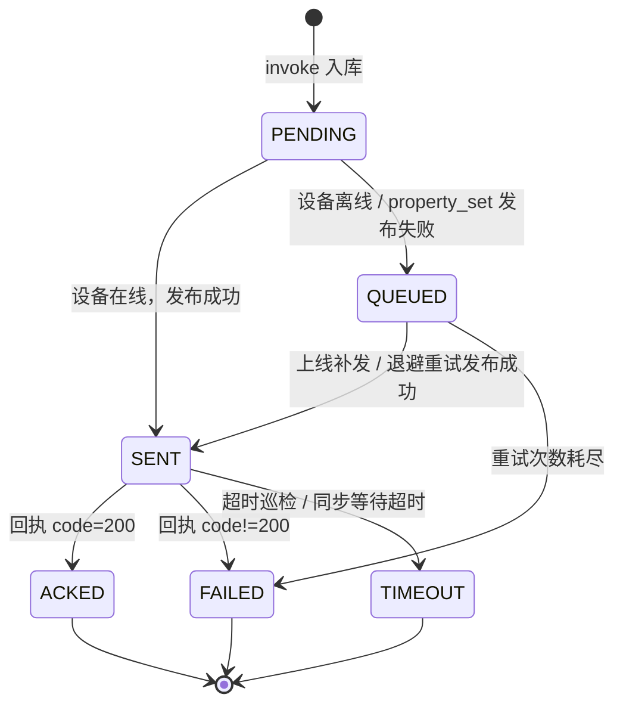

# T-16 设备影子（Device Shadow）设计文档

> 所属链路：L3 设备影子（`docs/平台功能链路路线图.md` §3）
> 依赖链路：L1 物模型与数据解析（T-14）、L2 命令下发与服务调用（T-15）
> 文档状态：待实施
> 最后更新：2026-10-02

---

## 1. 背景与目标

T-14 交付了物模型解析与属性最新值（`device_property_latest`），T-15 交付了命令下发与服务调用（`device_command_record` + `device/{deviceKey}/cmd/down`）。但当前实现对**离线设备无法控制**：对离线设备下发命令只会发布出去、等待超时，返回 `TIMEOUT`，期望值与命令一并丢失（T-15 §2.2 已明确把「设备影子 / 离线命令缓存」与「命令自动重试与指数退避」划归 T-16）。

本任务引入**设备影子（Device Shadow）**，用一个持久化的 JSON 文档描述设备的三种状态：

- `desired`：云端期望状态（由控制台 / 开放 API 写入）；
- `reported`：设备上报状态（由上行属性上报自动合并）；
- `delta`：`desired` 与 `reported` 的差异（服务端计算，设备侧可据此收敛）。

目标：

1. **离线可控**：设备离线时下发期望值不丢失，进入影子 `desired` 并排队，设备上线后自动补发。
2. **状态收敛**：设备上报后 `reported` 自动更新，`delta` 随之收敛清空。
3. **可追溯**：影子版本号（`version`）单调递增，任何一次影子变更都可被观测到。
4. **可重试**：补发失败按指数退避重试，次数耗尽后置终态并留痕。

---

## 2. 范围

### 2.1 在范围内

| 项 | 说明 |
| --- | --- |
| 影子数据模型 | 新增 `device_shadow` 表（`desired` / `reported` / `delta` / `version`），Flyway `V6` |
| 命令表扩展 | `device_command_record` 增加 `attempt_count` / `next_attempt_at` 两列与补发索引（**只加列，不改既有列**） |
| reported 自动更新 | 属性上报解析成功后合并进影子 `reported`，重算 `delta` 并递增 `version` |
| desired 写入 | 属性设置（`type=property_set`）在写入命令记录的同时写入影子 `desired` |
| delta 计算与查询 | 服务端按「归一化文本」口径比较 `desired` / `reported`，产出 `delta`；提供查询接口 |
| 离线入队与上线补发 | 设备非 `ONLINE` 时命令进入 `QUEUED`，设备上线（心跳 / 数据）后自动补发 |
| 自动重试与指数退避 | `QUEUED` 命令按 `base * 2^(n-1)`（封顶 `maxDelay`）退避重试，直到成功或次数耗尽 |
| 前端影子视图 | 设备详情新增「设备影子」面板，展示 desired / reported / delta 与版本号，支持写入期望值 |
| 开放 API | 影子查询与期望值写入接入开放 API（`SOURCE_OPEN_API`） |

### 2.2 不在范围内

| 项 | 归属 |
| --- | --- |
| 属性时序历史（影子只保留最新值） | T-21 |
| 批量 / 分组下发期望值 | T-18 |
| 规则引擎动作触发期望值 | T-19 |
| 设备侧影子 SDK 与本地持久化 | 不做（设备侧仅需处理 `cmd/down` 与上报属性） |
| 影子命名/多影子（一设备多影子） | 不做（一设备一影子） |
| 下行 QoS 2 与保留消息 | 继续统一 QoS 1、不保留（沿用 T-15 §4） |
| 影子变更的独立审计表 | 不做（`device_command_record` 已提供操作审计；影子变更随命令留痕） |

---

## 3. 术语

| 术语 | 含义 |
| --- | --- |
| 影子（Shadow） | 设备在云端的持久化状态副本，含 `desired` / `reported` / `delta` |
| desired | 云端期望状态，键为属性标识符，值为归一化文本 |
| reported | 设备最近一次上报的属性状态，口径同上 |
| delta | `desired` 中存在、且与 `reported` 不一致（含 `reported` 缺失）的键值集合 |
| 归一化文本 | `ThingModelParamValidator.normalize` 的产物（bool→`true`/`false`，数值→十进制字符串，enum→键，struct/array→JSON 文本） |
| QUEUED | T-16 新增命令状态：命令已入库、期望值已入影子，但设备不在线，待补发 |
| 补发 | 把 `QUEUED` 命令重新发布到 `device/{deviceKey}/cmd/down` 的过程 |

---

## 4. 主题方案

### 4.1 不新增主题

影子是**云端的概念**，不是设备侧的协议。设备侧感知「期望值」的方式与 T-15 完全一致：订阅 `device/{deviceKey}/cmd/down` 收到 `thing.service.property.set`，执行后回执 `device/{deviceKey}/reply`。因此：

- 期望值写入 = 一条 `type=property_set` 的下行消息（T-15 既有路径）；
- 离线补发 = 在设备上线后把这条消息**晚一点**再发一次；
- reported 更新 = 既有上行属性上报（`thing.event.property.post`）解析结果。

**结论：主题、QoS、ACL 全部零改动**，T-16 只增加持久化与调度逻辑。

### 4.2 ACL 影响分析

沿用 T-15 §4.3 结论，无新增主题，故 EMQX ACL 不需要任何调整：

- 平台发布仍落在 `device/{deviceKey}/cmd/down`（`topic.contains("/cmd/")` 规则放行）；
- 设备仍禁发自身 `cmd/` 前缀与他人前缀。

### 4.3 为什么期望值不新增专用主题

新增 `shadow/desired` 之类主题会带来三处额外成本：EMQX ACL 调整、设备侧固件升级、与 T-15 命令通道形成两套下发语义。复用 `cmd/down` 可让**已有设备无需改动**即可享受离线可控能力。

---

## 5. 载荷格式

影子不引入新载荷。复用 T-15 §5：

- 期望值下行（设备在线，立即发布 / 离线，上线后补发）：

```json
{
  "id": "3f7c1e6a-9b2d-4c5e-8a1b-0d2e3f4a5b6c",
  "version": "1.0",
  "method": "thing.service.property.set",
  "params": { "power": "on", "targetTemp": "25" }
}
```

- 设备回执（沿用 T-15）：

```json
{ "id": "3f7c1e6a-9b2d-4c5e-8a1b-0d2e3f4a5b6c", "version": "1.0", "method": "thing.service.property.set", "code": 200, "data": {} }
```

- 设备上报（沿用 T-14，驱动 `reported` 更新）：

```json
{ "id": "1", "version": "1.0", "method": "thing.event.property.post", "params": { "power": "on", "targetTemp": "25" } }
```

影子文档本身（`desired` / `reported` / `delta`）为**归一化文本**映射，例如：

```json
{
  "version": 7,
  "desired":  { "power": "on", "targetTemp": "25" },
  "reported": { "power": "on", "targetTemp": "24" },
  "delta":    { "targetTemp": "25" }
}
```

> **口径说明**：`desired` 与 `reported` 都经 `ThingModelParamValidator` 归一化后落库，两侧口径一致，故 `delta` 判定可安全地按**字符串相等**比较，不会出现 `25` 与 `25.0` 之类的伪差异。

---

## 6. 数据模型

### 6.1 `device_shadow` 表（V6 新增）

```sql
CREATE TABLE IF NOT EXISTS device_shadow (
    id          BIGINT AUTO_INCREMENT PRIMARY KEY,
    device_id   BIGINT NOT NULL COMMENT '设备ID',
    desired     JSON NULL COMMENT '期望状态：identifier -> 归一化文本',
    reported    JSON NULL COMMENT '上报状态：identifier -> 归一化文本',
    delta       JSON NULL COMMENT '差异：desired 中与 reported 不一致（含缺失）的键',
    version     BIGINT NOT NULL DEFAULT 0 COMMENT '影子版本号，单调递增',
    created_at  DATETIME(3) NOT NULL COMMENT '创建时间',
    updated_at  DATETIME(3) NOT NULL COMMENT '最近变更时间',
    UNIQUE KEY uk_shadow_device (device_id),
    CONSTRAINT fk_shadow_device FOREIGN KEY (device_id) REFERENCES device(id) ON DELETE CASCADE
) ENGINE=InnoDB DEFAULT CHARSET=utf8mb4 COLLATE=utf8mb4_unicode_ci COMMENT='设备影子';
```

设计要点：

- **一设备一行**（`uk_shadow_device`），懒创建：首次写入或首次查询时 `INSERT ... ON DUPLICATE KEY UPDATE` 保证存在。
- `version` 单调递增由 SQL `version = version + 1` 保证；应用侧用 **CAS（`WHERE device_id = ? AND version = ?`）** 避免共享订阅多副本并发合并时的丢失更新（见 §8.2）。
- `device_id` 外键 `ON DELETE CASCADE`，设备删除时影子一并清理。
- `created_at` / `updated_at` 均由应用显式赋值（毫秒精度），便于与 `device_command_record.created_at` 对时。

### 6.2 `device_command_record` 扩展（V6 ALTER，只加列）

```sql
ALTER TABLE device_command_record
    ADD COLUMN attempt_count   INT NOT NULL DEFAULT 0 COMMENT '补发尝试次数（QUEUED 阶段累计）',
    ADD COLUMN next_attempt_at DATETIME(3) NULL COMMENT '下次可补发时间（指数退避）';

CREATE INDEX idx_status_next_attempt ON device_command_record (status, next_attempt_at);
```

> 只新增可空列与索引，不修改既有列，**应用版本可安全回滚**（沿用 V5 迁移原则）。

### 6.3 命令状态机（T-16 扩展）



- 新增状态仅 `QUEUED`；既有状态语义不变。
- `queued → sent` 的条件更新守卫为 `status = 'QUEUED'`；既有迁移守卫 `status IN ('PENDING','SENT')` 保持不变，二者互不干扰。
- `QUEUED` 默认**不过期**（保证「不丢失」）；如需收敛由 `app.shadow.queue-ttl-ms`（默认 `0`=不启用）控制。

---

## 7. 参数校验

影子不新增校验规则，**完全复用** T-15 §7：

| 场景 | 校验 |
| --- | --- |
| 期望值写入（`property_set`） | 属性必须已定义（否则 6203）、`accessMode=rw`（否则 6202）、值通过 `ThingModelParamValidator.validate`（否则 6204） |
| 未建模产品 | 6201（`COMMAND_MODEL_MISSING`） |
| reported 合并 | 按物模型定义逐键 `normalize`，未定义或不合法者跳过并计数（上行宽松语义，与 T-14 一致） |

`DeviceShadowService` 的期望值写入入口统一走 `DeviceCommandService.invoke`（`type=property_set`），从而天然继承全部校验，不产生第二套规则。

---

## 8. 影子读写与 delta 计算

### 8.1 读取

`GET /devices/{deviceKey}/shadow` → `DeviceShadowResponse`：

```java
public record DeviceShadowResponse(
        boolean modeled,          // 产品是否有物模型
        long version,             // 影子版本号，懒创建时视为 0
        Map<String, String> desired,
        Map<String, String> reported,
        Map<String, String> delta,
        LocalDateTime updatedAt) {
}
```

- 影子行不存在时**不报错**，返回空 `desired`/`reported`/`delta`、`version=0`（前端可安全渲染空态）。
- `modeled=false` 时前端提示「产品未定义物模型，影子不可用」。

### 8.2 写入与版本并发

`DeviceShadowService` 内部统一走 **读-改-写 + CAS**：

1. 懒创建并读取当前影子（含 `version`）；
2. 在应用侧合并 `desired` / `reported`，重算 `delta`；
3. `UPDATE device_shadow SET desired=?, reported=?, delta=?, version=version+1, updated_at=? WHERE device_id=? AND version=?`；
4. 受影响行数为 0 → 说明并发变更，重读重算，最多重试 `app.shadow.cas-retry`（默认 3）次；仍失败则记 WARN 并放弃本次合并（下一次上报/写入自然覆盖）。

### 8.3 delta 计算规则

```text
delta = { k: desired[k] | k ∈ desired 且 (k ∉ reported 或 desired[k] ≠ reported[k]) }
```

- 只在 `desired` 的键上生成 delta（设备自主上报的、云端未期望的属性不产生 delta）。
- 当某键 `desired[k] == reported[k]` 时，该键从 delta 中移除 → 「收敛清空」。
- `desired` 中删除某键（清空期望）时，对应 delta 一并移除。

---

## 9. 离线入队、上线补发与重试退避

### 9.1 入队判定

`DeviceCommandServiceImpl.invoke` 在发布前判定设备是否可即时投递：

```text
可即时投递 := device.status == 'ONLINE' && device.enabled == 1 && 产品为 ENABLED
```

- **可即时投递** → 沿用 T-15 路径：`PENDING → SENT`（发布成功）。
- **不可即时投递且 `type=property_set`** → 不发布，直接置 `QUEUED`，`next_attempt_at = now`（上线后立即可发）。期望值同时写入影子 `desired`。
- **不可即时投递且 `type=service`** → 不排队（服务调用语义是「此刻执行」，排队无意义），**保持 T-15 既有行为**（仍发布并等待回执 / 超时），本任务不改变服务调用对离线设备的既有表现。
- **发布异常（`property_set`）** → 由 T-15 的「直接 `FAILED` + 抛 4001」改为置 `QUEUED` 并设置退避 `next_attempt_at`（可重试）且**不抛错**，使瞬时 Broker 抖动不丢命令；`type=service` 的发布异常仍按 T-15 抛 `4001`。

### 9.2 上线补发（事件驱动）

摄取落库后（`IngestDispatcher`）新增第五路 fan-out `ShadowDeliveryService.onIngest(events)`：

1. 从本批事件中取出 `messageType ∈ {data, heartbeat}` 的设备（即刚被置 `ONLINE` 的设备，去重）；
2. 对每个设备调用 `flushQueued(deviceId, limit)`：按 `next_attempt_at` 升序取 `QUEUED` 命令，逐条发布 `cmd/down`；
3. 发布成功 → `QUEUED → SENT`（`sent_at = now`）；失败 → `attempt_count+1` 并按退避重设 `next_attempt_at`。

- 逐条隔离异常，绝不让异常冒泡（沿用 `IngestDispatcher` 契约）。
- 该 fan-out 只做「有 `QUEUED` 才动作」的轻量判定：先按设备批量查一次 `QUEUED` 计数，为 0 直接返回，避免常态下无谓写库。

### 9.3 退避重试（定时巡检）

新增 `ShadowRetrySweeper`（`SchedulingConfigurer`，沿用 `CommandTimeoutSweeper` 的「间隔 ≤0 即关闭」范式）：

- 间隔 `app.shadow.retry-sweep-interval-ms`（默认 `30000`，`0` 关闭）。
- 每轮选取满足以下条件的 `QUEUED` 命令（`LIMIT app.shadow.resend-batch-size`，默认 `200`）：
  - `next_attempt_at IS NULL OR next_attempt_at <= NOW(3)`；
  - 关联设备 `status='ONLINE' AND enabled=1`；
  - 关联产品 `status='ENABLED'`。
- 逐条发布并迁移状态；发布失败则 `attempt_count+1`、`next_attempt_at = now + min(base * 2^(attempt-1), maxDelay)`。
- `attempt_count >= app.shadow.retry-max-attempts`（默认 `5`）→ 置 `FAILED`，`error_message='补发重试次数耗尽'`。

退避参数：`retry-base-delay-ms`（默认 `5000`）、`retry-max-delay-ms`（默认 `300000`）。

### 9.4 收敛触发点（reported 更新）

`ThingModelInterpretServiceImpl.interpretProperties` 在既有 `upsertIfNewer` 之后，收集本条消息中成功归一化的属性标识符，调用：

```java
deviceShadowService.applyReported(deviceId, identifiers);
```

- **口径以权威库为准**：`applyReported` 不回写调用方传入的值，而是按键从 `device_property_latest` **回读权威最新值**再合并进影子 `reported`。乱序旧包在 `upsertIfNewer` 的时间戳守卫处已被丢弃，影子天然继承同一份守卫，无需二次判定（例：新包已写入 `25`，后到的旧包值 `24` 被 `upsertIfNewer` 拒绝，回读得到的仍是 `25`）。
- 这样也解决了「影子启用前已有属性值」的收敛问题：`device_property_latest` 中已存在但影子里尚缺的键，会在下一次上报时被回读补齐。
- 合并后重算 `delta` 并递增 `version`；若某 `desired` 键被 `reported` 追平，该键从 delta 移除。
- 单条合并异常只记 WARN，不影响本批其余消息（沿用 T-14 逐条隔离）。

---

## 10. 接口

### 10.1 控制台接口（`DeviceController`，归属校验沿用 `requireOwnedDevice`）

| 方法 | 路径 | 说明 | 主要错误码 |
| --- | --- | --- | --- |
| GET | `/devices/{deviceKey}/shadow` | 查询影子（desired/reported/delta/version） | 2002 / 2003 |
| PUT | `/devices/{deviceKey}/shadow/desired` | 写入期望值：body `{ "params": { "identifier": 值 } }`，等价于 `type=property_set` 命令，返回命令记录（在线 `SENT` / 离线 `QUEUED`） | 2002 / 2003 / 6004 / 6005 / 6201 / 6202 / 6203 / 6204 |
| POST | `/devices/{deviceKey}/commands` | 既有接口不变；`type=property_set` 现同时写入影子 `desired`，离线返回 `QUEUED` 而非 `TIMEOUT` | 同上 |
| GET | `/devices/{deviceKey}/commands` | 既有接口不变；`status` 可能出现 `QUEUED` | 2002 / 2003 |

`PUT .../shadow/desired` 的请求体复用 `CommandInvokeRequest`（`type` 忽略并强制为 `property_set`，`callType` 强制 `async`——离线排队场景不适用同步等待）。

### 10.2 开放 API（`ExternalApiController`，基路径 `/external/v1`）

| 方法 | 路径 | 说明 |
| --- | --- | --- |
| GET | `/external/v1/devices/{deviceKey}/shadow` | 影子查询（按 API Key 归属校验，`requireOwnedDevice`） |
| PUT | `/external/v1/devices/{deviceKey}/shadow/desired` | 期望值写入，`source=OPEN_API`、`operatorId=null` |

### 10.3 错误码（`ResultCode`，自 6206 起）

| 码 | 常量 | 文案 | HTTP |
| --- | --- | --- | --- |
| 6206 | `SHADOW_DESIRED_INVALID` | 影子期望状态非法（params 缺失或为空） | 400 |

> 属性级校验（未建模 / 只读 / 未定义 / 值非法）继续复用 T-15 的 `6201`~`6204`，不新增同义码。
> `6206` 仅用于**影子期望值端点在进入命令通道之前**的入参兜底（给出比通用 `6204` 更明确的语义）；命令通道内部仍用 `6204`。
> **不引入版本冲突错误码**：影子写入的内部 CAS 冲突由服务内重试消化，重试耗尽后仅记 WARN 并放弃本次合并（影子是最终一致的尽力视图，不应因并发失败阻断命令 / 上报主链路），因此没有面向客户端的「版本冲突」错误。

---

## 11. 前端设计

### 11.1 组件

- 新增 `frontend/src/components/device/DeviceShadowPanel.vue`：三列对照展示 `desired` / `reported` / `delta`，顶部展示 `version` 与 `updatedAt`；
  - 仅对**可写属性**（`command-capability` 返回的 `properties`）提供「设置期望值」输入与下发按钮；
  - `delta` 非空时高亮对应键，提供「下发期望值」一键补发（重新提交 `params`）；
  - 设备离线时提示「设备离线，期望值已保存，上线后自动下发」。
- 在 `views/workbench/device/DeviceDetail.vue` 中与 `DeviceControlPanel.vue` 并列挂载。

### 11.2 数据层

- 新增 composable `frontend/src/composables/useDeviceShadow.js`（Vue Query）：`useDeviceShadowQuery(deviceKey)`、`useSetShadowDesiredMutation(deviceKey)`；写期望值成功后失效影子查询与命令记录查询。
- 在 `frontend/src/api/device.js` 增加 `getDeviceShadow(deviceKey)`、`setDeviceShadowDesired(deviceKey, params)`。
- 命令记录列表（`DeviceCommandHistory.vue`）增加 `QUEUED` 状态标签与「待补发」文案。

### 11.3 刷新策略

- 影子数据随命令记录一并轮询（沿用现有命令记录刷新策略）；设备上线补发后 `delta` 收敛，前端通过查询失效自动刷新。

---

## 12. 配置项（YAML）

```yaml
app:
  shadow:
    resend-enabled: ${SHADOW_RESEND_ENABLED:true}          # 上线补发总开关
    retry-max-attempts: ${SHADOW_RETRY_MAX_ATTEMPTS:5}     # 补发重试上限，达到置 FAILED
    retry-base-delay-ms: ${SHADOW_RETRY_BASE_DELAY_MS:5000}   # 指数退避基数
    retry-max-delay-ms: ${SHADOW_RETRY_MAX_DELAY_MS:300000}   # 退避封顶
    retry-sweep-interval-ms: ${SHADOW_RETRY_SWEEP_INTERVAL_MS:30000}  # 巡检间隔，0 关闭
    resend-batch-size: ${SHADOW_RESEND_BATCH_SIZE:200}     # 单轮/单设备补发上限
    cas-retry: ${SHADOW_CAS_RETRY:3}                       # 影子 CAS 冲突重试次数
    queue-ttl-ms: ${SHADOW_QUEUE_TTL_MS:0}                 # QUEUED 过期时长，0=不过期
```

新增 `ShadowProperties`（`@ConfigurationProperties(prefix = "app.shadow")`），风格对齐 `CommandProperties`。

---

## 13. 安全与边界

- **归属校验**：影子接口与命令接口一致，非归属用户返回 `2003`，设备不存在/已删除返回 `2002`（沿用 `DeviceController.checkOwnership`）。
- **禁用设备不补发**：`enabled=0` 或产品 `DISABLED` 的设备不予补发（复用 `DeviceAccessGuard.isPermitted` 口径）；已建立的 `QUEUED` 记录保留，待恢复后由巡检补发。
- **搬迁/删除**：设备删除（逻辑删除）后影子行随外键级联清理（物理删除时）；逻辑删除时巡检按 `device.deleted=0` 过滤，不再补发。
- **参数体积**：期望值写入受 T-15 的 `app.command.max-params-bytes`（默认 16384）约束，防止超大载荷。
- **多副本并发**：影子合并用 CAS + 时间戳守卫；补发用 `status='QUEUED' → 'SENT'` 条件更新，重复补发只会被守卫丢弃（幂等）。
- **不阻塞主链路**：补发与重试全程 try/catch 隔离，异常不冒泡，不影响摄取 worker 与接口响应。
- **对设备的最小要求**：设备无需任何改动即可受益（仍只需处理 `cmd/down` 与上报属性）；若设备主动上报已应用状态，`delta` 会自动收敛。

---

## 14. 测试与验收

### 14.1 单元测试

- `DeviceShadowServiceImplTest`：懒创建、delta 计算（缺失键 / 相等 / 不等 / 清空）、版本单调递增、CAS 冲突重试。
- `ShadowDeliveryServiceImplTest`：上线补发（`QUEUED → SENT`）、发布失败退避、次数耗尽 `FAILED`、投递条件判定（离线/禁用/产品停用）。
- `DeviceCommandServiceImplTest`（扩展）：离线 `property_set` 置 `QUEUED` 且写入 `desired`；在线 `property_set` 写 `desired` 并将 `delta` 收敛；发布异常转 `QUEUED`。
- `ThingModelInterpretServiceImplTest`（扩展）：属性上报驱动 `reported` 合并、乱序旧包被时间守卫丢弃、非法值跳过。

### 14.2 端到端验收（A 项）

| 编号 | 场景 | 预期 |
| --- | --- | --- |
| A1 | 设备离线，控制台设置期望值 `targetTemp=25` | 返回 `QUEUED`；影子 `desired.targetTemp=25`、`delta.targetTemp=25`、`version` 递增 |
| A2 | 设备上线（心跳/数据） | 自动收到 `cmd/down`（`thing.service.property.set`，`params.targetTemp=25`），命令 `QUEUED → SENT` |
| A3 | 设备回执 `code=200` 并上报 `targetTemp=25` | 命令 `ACKED`；影子 `reported.targetTemp=25`、`delta` 中该键清空、`version` 递增 |
| A4 | 在线设备设置期望值 | 立即发布，`SENT`；影子 `desired` 更新 |
| A5 | 设备上报与期望一致的值 | `delta` 清空，`version` 递增，`reported` 更新 |
| A6 | 期望值与上报持续不一致 | `delta` 持续保留该键，直至上报追平 |
| A7 | 补发发布失败 | `attempt_count` 递增、`next_attempt_at` 按指数退避后移，最终可成功 |
| A8 | 重试次数耗尽 | 命令置 `FAILED`，`error_message='补发重试次数耗尽'`；`desired` 保留不丢 |
| A9 | 对已禁用设备（`enabled=0`）设置期望值 | 返回 `6005`，不产生记录；若设备在排队后被禁用，`QUEUED` 保留且暂停补发，恢复启用后由巡检继续补发 |
| A10 | 影子版本号 | 任意影子变更后 `version` 严格递增，无回退 |
| A11 | 非归属用户访问影子接口 | 返回 `2003` |
| A12 | 未建模产品设备查询影子 | `modeled=false`，空影子，不报错 |

### 14.3 回归门禁

- 后端：`mvn -B verify` 全绿（含 ArchUnit：`DeviceShadowService` 接口不得依赖 `mapper`）。
- 前端：`npm run lint`（0 error）、`npm run test`、`npm run build` 全绿。
- 迁移可在既有库（已执行 V1~V5）上平滑升级，且**回滚应用版本不需要回滚 V6**（只加表 / 只加列）。

---

## 15. 变更记录

| 版本 | 时间 | 说明 |
| --- | --- | --- |
| v1.0 | 2026-10-02 | 初稿：影子数据模型、reported/desired/delta、离线入队与补发重试、控制台与开放 API、前端视图 |
| v1.1 | 2026-10-02 | 自审修正：开放 API 基路径更正为 `/external/v1`；reported 合并改为「回读权威库 + 继承 `upsertIfNewer` 时间戳守卫」；删除未被使用的 `6207` 版本冲突码；明确 service 类型离线行为保持 T-15 不变、`property_set` 发布异常转 `QUEUED` 且不抛错 |
