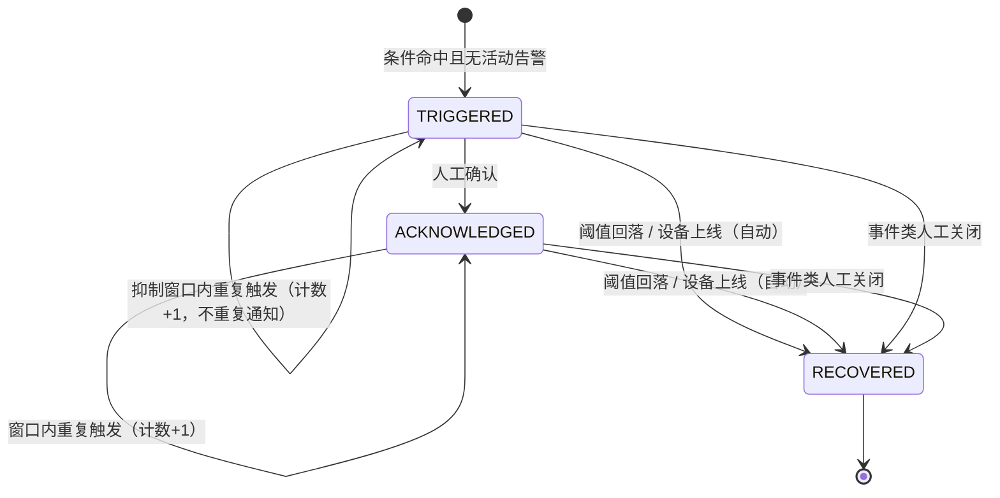

# T-17 告警中心（Alert Center）设计文档

> 所属链路：L4 告警中心（`docs/平台功能链路路线图.md` §4）
> 依赖链路：L1 物模型与数据解析（T-14）、L2 命令下发与服务调用（T-15，可选联动）
> 文档状态：已交付（2026-10-02）
> 最后更新：2026-10-02

---

## 1. 背景与目标

T-14 交付了物模型解析（属性最新值 `device_property_latest`、事件记录 `device_event_record`），T-15/T-16 交付了命令下发与设备影子。但平台目前**只存数据、不产生结论**：

- 属性越限只是「一条最新值」，无人知晓；
- 设备离线只体现为 `device.status=OFFLINE`，事后无从追溯「什么时候离的线、离了多久」；
- 事件上报按 `device_event_record` 追加落库，`V4__thing_model.sql` 已明确注释「**去重属告警中心抑制窗口职责**」，该职责至今无人承担；
- 顶栏通知图标自 T-13 起就是**纯占位**（`TopBar.vue` 中 `hasUnread = computed(() => false)`）。

本任务引入**告警中心**，把「数据」变成「可订阅、可跟踪、可恢复的告警」：

- **三类来源**：属性阈值（`THRESHOLD`）、设备离线（`OFFLINE`）、事件上报（`EVENT`）。
- **状态流转**：触发（`TRIGGERED`）→ 确认（`ACKNOWLEDGED`）→ 恢复（`RECOVERED`）。
- **通知出口**：复用既有 Webhook（`WebhookDispatcher`），新增 `alert.triggered` / `alert.recovered` 两个事件类型，不新建通知通道。
- **抑制窗口**：同一 `(设备, 规则)` 的重复告警在窗口内只累加计数、不重复落库、不重复回调，窗口外可再次提醒。

目标：

1. **可配置**：用户按设备（或全部设备）配置阈值 / 离线 / 事件三类规则，可启停。
2. **可触发**：越限、离线超阈值、事件命中均产出告警记录，并回调已订阅 Webhook。
3. **可恢复**：指标回落、设备重新上线自动置 `RECOVERED`；事件类告警由人工确认关闭。
4. **可去重**：抑制窗口内重复触发只累加 `trigger_count`、刷新 `last_triggered_at`，不产生新记录。
5. **可见**：顶栏通知中心接入真实未读数与最近告警，控制台提供规则配置页与告警列表页。

---

## 2. 范围

### 2.1 在范围内

| 项 | 说明 |
| --- | --- |
| 告警规则数据模型 | 新增 `alert_rule` 表（阈值 / 离线 / 事件三种来源，Flyway `V7`） |
| 告警记录数据模型 | 新增 `alert_record` 表（含状态、计数、抑制窗口基准时间） |
| 阈值告警评估 | 属性上报解析成功后按规则比较，越限触发、回落恢复 |
| 离线告警评估 | 由巡检（`AlertSweeper`）周期性评估 `device.status=OFFLINE` 且离线时长超阈值的设备 |
| 事件告警评估 | 事件记录落库后按规则命中，产出告警（瞬时事件，人工关闭） |
| 抑制窗口去重 | 同一 `(device, rule)` 活动告警在窗口内累加计数，不重复落库 / 不重复通知 |
| 状态流转 | `TRIGGERED` / `ACKNOWLEDGED` / `RECOVERED` 三态与确认、恢复接口 |
| 通知复用 Webhook | 新增 `alert.triggered` / `alert.recovered` 事件类型，走既有 `WebhookDispatcher`（HMAC 签名 / 自定义头 / 异步线程池） |
| 控制台接口 | 规则 CRUD、告警列表 / 详情、确认、恢复、未读数 |
| 开放 API | 告警列表查询、告警规则查询接入 `/external/v1` |
| 前端 | 新增「告警规则」页与「告警列表」页；`TopBar.vue` 通知中心接入真实数据与未读角标 |
| 配置项 | 新增 `app.alert.*` 配置块 |

### 2.2 不在范围内

| 项 | 归属 |
| --- | --- |
| 规则引擎 / 场景联动（告警触发命令下发、多条件组合） | T-19（T-17 仅产出告警与通知，不执行动作） |
| 批量 / 分组下发（含批量规则作用域） | T-18 |
| 属性时序历史与趋势分析 | T-21 |
| 短信 / 邮件 / 站内信等新通知通道 | 不做（统一由 Webhook 承担；Webhook 为唯一出口） |
| 告警升级（长时间未确认自动升级级别） | 不做 |
| 自定义告警聚合 / 收敛算法（同类合并） | 不做（仅抑制窗口去重） |
| 告警规则的物模型级自动生成（按 min/max 批量生成项） | 不做 |
| 消息积压 / 设备离线「无数据」类告警（区别于 status 离线） | 不做 |

---

## 3. 术语

| 术语 | 含义 |
| --- | --- |
| 告警规则（AlertRule） | 用户定义的判定条件，含来源类型、作用域设备、阈值 / 离线时长 / 事件标识符、级别与抑制窗口 |
| 告警记录（AlertRecord） | 一次「活动告警」的持久化实体，跨多次重复触发复用一行，直到 `RECOVERED` |
| 来源类型（sourceType） | `THRESHOLD`（属性阈值）/ `OFFLINE`（设备离线）/ `EVENT`（事件上报） |
| 级别（severity） | `INFO` / `WARNING` / `CRITICAL`，仅用于展示与过滤，不影响判定 |
| 抑制窗口（suppressWindow） | 同一活动告警在窗口内重复触发只累加计数、不重复通知的时间窗 |
| 触发（TRIGGERED） | 条件命中且尚无活动告警，或距上次通知已超出抑制窗口 |
| 确认（ACKNOWLEDGED） | 人工确认已知晓，告警仍活动；不阻断后续恢复 |
| 恢复（RECOVERED） | 条件不再命中（阈值回落 / 设备上线）自动置位，或事件类告警人工关闭；终态 |
| 归一化文本 | `ThingModelParamValidator.normalize` 的产物（阈值比较与触发值落库统一口径） |

---

## 4. 主题方案

### 4.1 不新增 MQTT 主题

告警中心**完全运行在服务端**，不新增任何上下行主题：

- **数据来源**：全部来自已落库的解析产物（`device_property_latest` / `device_event_record`）与设备运行态（`device.status` / `device.last_seen`），不额外订阅 MQTT。
- **通知出口**：Webhook（HTTP 回调），不经 MQTT。
- **可选动作**：T-19 若需「告警触发下发命令」，届时复用 T-15 的 `device/{deviceKey}/cmd/down`，本任务不做。

因此 ACL、QoS、保留消息策略**均无变化**（继续 QoS 1、不保留，沿用 T-15 §4）。

### 4.2 权限与隔离

- 告警规则与记录均按 `user_id` 隔离，接口层用 `SecurityUtils.requireUserId()` 取当前用户，仅可读写本人数据（对齐 `WebhookController.requireOwnedWebhook` 范式）。
- 规则作用域 `device_id` 为 `NULL` 时表示「该用户全部设备」；非 `NULL` 时必须校验设备归属（`device.owner_id = userId`），否则返回 `2003`。
- 开放 API（`/external/v1`）仅提供**只读**告警能力（列表 / 详情 / 未读数），规则写操作仅限控制台，降低密钥误操作风险。

### 4.3 为什么复用 Webhook 而不新建通知通道

- T-13 已交付 `WebhookDispatcher`：HMAC-SHA256 签名（`X-Signature: sha256=…`）、`X-Event-Type` 头、自定义请求头、`webhookExecutor` 异步投递、2xx 更新 `last_triggered_at`，并已具备按 `events` 字段匹配订阅的能力（`supportsEvent` 为 `contains` 判定）。
- 复用后用户「配置一次回调地址，事件类型多选」，无需为告警单独维护一套地址 / 密钥 / 重试。
- 代价极小：仅在事件目录中**新增两个事件类型字符串**（`alert.triggered` / `alert.recovered`），投递路径零改动。

---

## 5. 载荷格式

### 5.1 Webhook 通知载荷

沿用 `WebhookDispatcher.buildBody` 的既有信封（`event` / `deviceKey` / `deviceName` / `deviceType` / `topic` / `status` / `payload` / `timestamp`），`payload` 字段承载告警详情 JSON 文本：

| event | payload（JSON 文本）字段 |
| --- | --- |
| `alert.triggered` | `alertId`、`ruleId`、`ruleName`、`sourceType`、`severity`、`identifier`、`title`、`triggerValue`、`triggerCount`、`firstTriggeredAt`、`lastTriggeredAt` |
| `alert.recovered` | `alertId`、`ruleId`、`ruleName`、`sourceType`、`severity`、`title`、`triggerCount`、`recoveredAt` |

示例（`alert.triggered`）：

```json
{
  "event": "alert.triggered",
  "deviceKey": "dev-001",
  "deviceName": "1号温控器",
  "deviceType": "sensor",
  "topic": "device/dev-001/data/up",
  "status": "ONLINE",
  "payload": "{\"alertId\":12,\"ruleId\":3,\"ruleName\":\"高温告警\",\"sourceType\":\"THRESHOLD\",\"severity\":\"CRITICAL\",\"identifier\":\"temperature\",\"title\":\"温度超过 80\",\"triggerValue\":\"86.5\",\"triggerCount\":1,\"firstTriggeredAt\":\"2026-10-02T10:00:00.123\",\"lastTriggeredAt\":\"2026-10-02T10:00:00.123\"}",
  "timestamp": 1759392000123
}
```

### 5.2 控制台 / 开放 API 返回体

统一走既有 `Result<T>` 信封（`code` / `message` / `data`）。告警记录返回 `AlertRecord` 实体字段（含冗余快照 `deviceKey` / `ruleName` / `severity`，设备或规则改名后历史仍可读）。

---

## 6. 数据模型（Flyway `V7`）

> 迁移原则：**只加表、只加列**，不改既有列；应用版本可安全回滚（回滚后新旧表共存，旧代码忽略新表）。

### 6.1 新表 DDL

```sql
-- V7：告警中心（T-17）
-- 1) 告警规则；2) 告警记录。
-- 只加表，不改既有列，应用版本可安全回滚。

CREATE TABLE IF NOT EXISTS alert_rule (
    id BIGINT AUTO_INCREMENT PRIMARY KEY,
    user_id BIGINT NOT NULL COMMENT '规则归属用户',
    device_id BIGINT NULL COMMENT '作用设备ID，NULL=该用户全部设备',
    name VARCHAR(64) NOT NULL COMMENT '规则名称',
    source_type VARCHAR(16) NOT NULL COMMENT '来源：THRESHOLD/OFFLINE/EVENT',
    severity VARCHAR(16) NOT NULL DEFAULT 'WARNING' COMMENT '级别：INFO/WARNING/CRITICAL',
    identifier VARCHAR(64) NULL COMMENT '属性/事件标识符（THRESHOLD/EVENT 必填）',
    operator VARCHAR(8) NULL COMMENT '比较符：GT/GTE/LT/LTE/EQ/NE（THRESHOLD 必填）',
    threshold_value VARCHAR(255) NULL COMMENT '阈值（归一化文本，THRESHOLD 必填）',
    event_type VARCHAR(16) NULL COMMENT '事件类型过滤：info/alert/fault（EVENT 可选）',
    offline_seconds INT NOT NULL DEFAULT 0 COMMENT '离线持续阈值（秒，OFFLINE 用，0=立即）',
    suppress_window_seconds INT NOT NULL DEFAULT 0 COMMENT '抑制窗口（秒，0=用全局默认）',
    enabled TINYINT(1) NOT NULL DEFAULT 1 COMMENT '是否启用：1/0',
    created_at DATETIME(3) NOT NULL COMMENT '创建时间',
    updated_at DATETIME(3) NOT NULL COMMENT '更新时间',
    deleted TINYINT(1) NOT NULL DEFAULT 0 COMMENT '逻辑删除：1/0',
    INDEX idx_rule_user (user_id, enabled),
    INDEX idx_rule_source (source_type, enabled),
    INDEX idx_rule_device (device_id),
    CONSTRAINT fk_alert_rule_device FOREIGN KEY (device_id) REFERENCES device(id) ON DELETE CASCADE
) ENGINE=InnoDB DEFAULT CHARSET=utf8mb4 COLLATE=utf8mb4_unicode_ci COMMENT='告警规则';

CREATE TABLE IF NOT EXISTS alert_record (
    id BIGINT AUTO_INCREMENT PRIMARY KEY,
    user_id BIGINT NOT NULL COMMENT '归属用户（冗余，便于列表隔离）',
    device_id BIGINT NOT NULL COMMENT '设备ID',
    device_key VARCHAR(64) NOT NULL COMMENT '设备标识快照',
    rule_id BIGINT NOT NULL COMMENT '规则ID',
    rule_name VARCHAR(64) NOT NULL COMMENT '规则名快照',
    source_type VARCHAR(16) NOT NULL COMMENT '来源快照：THRESHOLD/OFFLINE/EVENT',
    severity VARCHAR(16) NOT NULL COMMENT '级别快照',
    identifier VARCHAR(64) NULL COMMENT '属性/事件标识符',
    title VARCHAR(255) NOT NULL COMMENT '告警标题',
    trigger_value VARCHAR(512) NULL COMMENT '触发值 / 事件输出（归一化文本或 JSON）',
    status VARCHAR(16) NOT NULL COMMENT 'TRIGGERED/ACKNOWLEDGED/RECOVERED',
    trigger_count INT NOT NULL DEFAULT 1 COMMENT '累计触发次数（抑制窗口内累加）',
    first_triggered_at DATETIME(3) NOT NULL COMMENT '首次触发时间',
    last_triggered_at DATETIME(3) NOT NULL COMMENT '最近触发时间（抑制窗口基准）',
    notified_at DATETIME(3) NULL COMMENT '最近一次回调通知时间',
    acknowledged_at DATETIME(3) NULL COMMENT '确认时间',
    acknowledged_by BIGINT NULL COMMENT '确认人用户ID',
    recovered_at DATETIME(3) NULL COMMENT '恢复时间',
    created_at DATETIME(3) NOT NULL COMMENT '创建时间',
    updated_at DATETIME(3) NOT NULL COMMENT '更新时间',
    INDEX idx_alert_user_status (user_id, status),
    INDEX idx_alert_device_status (device_id, status),
    INDEX idx_alert_rule_open (rule_id, status, last_triggered_at),
    CONSTRAINT fk_alert_record_device FOREIGN KEY (device_id) REFERENCES device(id) ON DELETE CASCADE
) ENGINE=InnoDB DEFAULT CHARSET=utf8mb4 COLLATE=utf8mb4_unicode_ci COMMENT='告警记录';
```

### 6.2 实体与 Mapper

- `entity/AlertRule.java`：`@TableName("alert_rule")`，字段与上表一一对应；`createdAt` 用 `fill = FieldFill.INSERT`、`updatedAt` 用 `INSERT_UPDATE`；`deleted` 走全局逻辑删除（`logic-delete-field: deleted`）。
- `entity/AlertRecord.java`：`@TableName("alert_record")`，**无逻辑删除**（记录保留完整生命周期，仅通过状态收敛）。
- `mapper/AlertRuleMapper.java`：`BaseMapper<AlertRule>`，另加 `selectEnabledByUser`（按用户 + sourceType + `enabled=1` + `deleted=0`）。
- `mapper/AlertRecordMapper.java`：`BaseMapper<AlertRecord>`，另加：
  - `selectOpenByRuleAndDevice(ruleId, deviceId)`：取 `status <> 'RECOVERED'` 的活动记录（用于去重与恢复）；
  - `countOpenByUser(userId)`：未读数；
  - `selectOpenByRule(ruleId, limit)`：离线巡检按规则批量取活动记录（用于恢复判定）。

### 6.3 状态机



- `RECOVERED` 为终态；条件再次命中会**新建**一行记录（历史可追溯），不会复活旧行。
- 同一 `(device_id, rule_id)` 在任一时刻至多存在 **1 行活动记录**（`status <> 'RECOVERED'`），由「先查后写 + 唯一活动约束由服务保证」实现；并发场景由数据库行锁（对活动行的 `UPDATE ... WHERE status <> 'RECOVERED'`）与重复插入去重兜底。

---

## 7. 参数校验

### 7.1 规则创建 / 更新校验（`AlertRuleRequest`）

| 规则 | 校验 | 失败码 |
| --- | --- | --- |
| `name` | 非空，长度 ≤ 64 | `6208` |
| `sourceType` | 必须是 `THRESHOLD` / `OFFLINE` / `EVENT` | `6208` |
| `severity` | 缺省 `WARNING`；必须是 `INFO` / `WARNING` / `CRITICAL` | `6208` |
| `deviceId` | 可空；非空时设备必须存在且属于当前用户 | `2002` / `2003` |
| `identifier` | `THRESHOLD` / `EVENT` 必填，长度 ≤ 64 | `6208` |
| `operator` | `THRESHOLD` 必填，必须是 `GT` / `GTE` / `LT` / `LTE` / `EQ` / `NE` | `6208` |
| `thresholdValue` | `THRESHOLD` 必填；当 `operator` 为数值比较符时必须是可解析的十进制数 | `6208` |
| `eventType` | `EVENT` 可选；非空时必须是 `info` / `alert` / `fault` | `6208` |
| `offlineSeconds` | `OFFLINE` 用；缺省 0，取值 `[0, 86400]` | `6208` |
| `suppressWindowSeconds` | 缺省 0（用全局默认），取值 `[0, 86400]` | `6208` |
| `enabled` | 缺省 1，取值 `0` / `1` | `6208` |

> 阈值与标识符**不与物模型强绑定**：物模型可能尚未建模或后续变更，规则只按「归一化文本」口径比较，避免规则与物模型耦合（越限判定不因物模型改动而失效）。

### 7.2 触发值校验

- 阈值比较：把 `device_property_latest.value_text` 与 `threshold_value` 按规则 `operator` 解释。数值比较符（`GT/GTE/LT/LTE`）两侧均为十进制数时按 `BigDecimal.compareTo` 比较；任一侧不可解析为数值时该次**跳过**（不触发，记 WARN）。
- 枚举 / 文本：`EQ` / `NE` 按字符串相等比较。
- 事件匹配：`identifier` 相等，且 `eventType` 为空或与 `device_event_record.event_type` 相等。

---

## 8. 评估与抑制窗口计算

### 8.1 三个评估入口

| 来源 | 触发时机 | 实现方式 | 说明 |
| --- | --- | --- | --- |
| `THRESHOLD` | 属性上报解析成功后 | **推**（`ThingModelInterpretServiceImpl` 内调用） | 逐属性样本即时比较，越限触发、回落恢复 |
| `EVENT` | 事件记录落库后 | **推**（`ThingModelInterpretServiceImpl.flushEvents` 成功后调用） | 命中规则即触发；无自动恢复，人工关闭 |
| `OFFLINE` | 周期巡检 | **拉**（`AlertSweeper`） | 评估 `status=OFFLINE` 且离线时长超阈值；设备恢复上线自动置 `RECOVERED` |

> **为什么离线用「拉」而非挂在状态变更钩子**：状态改写有多个入口（`IngestPersistenceService.updateDeviceStates` 批量路径、`DeviceServiceImpl.updateDeviceStatus` 单条路径、`DeviceMonitorService` 超时巡检、LWT 直接离线），逐个挂钩既侵入主链路又易漏；改为周期性巡检后，**新建规则对「已离线设备」同样生效**，且无需改动任何既有状态写入逻辑。阈值 / 事件用「推」是因为其数据源（解析结果）本就聚合在解析服务的单点调用内。

### 8.2 评估核心（`AlertEvaluationServiceImpl`）

对每个命中的 `(rule, device)`：

1. **查活动告警**：`selectOpenByRuleAndDevice(ruleId, deviceId)`。
2. **无活动告警** → 新建 `AlertRecord`（`status=TRIGGERED`，`trigger_count=1`，`first/last_triggered_at=now`），落库，发 `alert.triggered` 通知。
3. **有活动告警**：
   - 若 `now - last_triggered_at <= 抑制窗口` → **去重**：`trigger_count += 1`、`last_triggered_at = now`、刷新 `trigger_value`，**不落新行、不重复通知**。
   - 若已超出抑制窗口 → `trigger_count += 1`、`last_triggered_at = now`、`notified_at = now`，**再次发通知**（长时未收敛的告警需要再次提醒）。
4. **恢复**：命中「恢复条件」（阈值回落 / 设备上线）且有活动告警 → `status=RECOVERED`、`recovered_at=now`，发 `alert.recovered` 通知。

抑制窗口取值：`rule.suppressWindowSeconds > 0 ? rule.suppressWindowSeconds : app.alert.suppress-window-seconds`（默认 300 秒）。

### 8.3 离线巡检（`AlertSweeper`）

`config/AlertSweeper.java`，`implements SchedulingConfigurer`（对齐 `ShadowRetrySweeper` / `CommandTimeoutSweeper` 范式），按 `app.alert.sweep-interval-ms`（默认 30000，`<= 0` 关闭）注册固定频率任务：

1. 取启用中的 `OFFLINE` 规则（按 `app.alert.sweep-batch-size` 分批）。
2. **触发**：对每条规则，查作用域内 `deleted=0`、`status='OFFLINE'` 且（`last_seen` 为空 或 `last_seen <= now - offlineSeconds`）的设备，逐个走 §8.2 评估（去重 / 新建）。
3. **恢复**：对每条规则的活动告警，若对应设备已非 `OFFLINE`（重新上线），置 `RECOVERED` 并发通知。

> 离线判定口径与 `DeviceMonitorService` 保持一致（同为「超时未上报」），但**阈值独立**：设备状态先按 `app.device.status-timeout`（默认 300s）变 `OFFLINE`，告警规则的 `offlineSeconds` 再叠加判定（`0` 表示状态一变 `OFFLINE` 即告警）。

### 8.4 通知（`AlertNotifierImpl`）

- 依赖 `WebhookDispatcher`；`alert.triggered` / `alert.recovered` 复用其 `dispatch(deviceId, eventType, device, payload)` 重载（内部按 `supportsEvent` 匹配订阅、异步投递、HMAC 签名）。
- 载荷 JSON 由 `ObjectMapper` 序列化（§5.1）。
- **逐条隔离**：通知异常只记 WARN，不影响评估与落库（对齐 `IngestDispatcher` 的隔离契约）。

### 8.5 与解析链路的接入

`ThingModelInterpretServiceImpl` 增加两处**旁路调用**（均在既有 try/catch 隔离下）：

- `interpretProperties`：逐属性 `upsertIfNewer` 成功后收集 `PropertySample(identifier, valueText, reportedAt)`；本方法末尾一次性调用 `alertEvaluationService.onProperties(deviceId, productId, samples)`，整体 try/catch，异常仅 WARN。
- `flushEvents`：批量 `insertBatch` 成功后，对成功落库的事件记录调用 `alertEvaluationService.onEvents(deviceId, samples)`，同样 try/catch。

> 不新增 `IngestDispatcher` fan-out 路：解析服务本身就是 fan-out 的一路，告警是其下游语义，挂在同一路内可复用已解析结果，避免重复解析与额外查询。

---

## 9. 离线入队与补发重试

告警中心**不涉及**入队与补发（该职责属 T-15/T-16）。此处仅声明交互边界：

- 告警通知走 Webhook HTTP 回调，**无 QUEUED 概念**；投递失败由既有 `WebhookDispatcher` 记 ERROR（当前不重试，沿用 T-13 行为）。
- 若 T-19 需要「告警触发命令」，届时命令的离线入队与补发完全复用 T-15/T-16 通道，本任务不实现。

---

## 10. 接口设计

### 10.1 控制台接口（`AlertController`，`@RequestMapping("/alerts")`）

| 方法 | 路径 | 说明 | 错误码 |
| --- | --- | --- | --- |
| `GET` | `/alerts/rules` | 规则列表（本人，可按 `sourceType` / `enabled` 过滤） | — |
| `POST` | `/alerts/rules` | 创建规则 | `6208` / `2002` / `2003` |
| `GET` | `/alerts/rules/{id}` | 规则详情（越权 `403`） | `6207` |
| `PUT` | `/alerts/rules/{id}` | 更新规则（同创建校验） | `6207` / `6208` |
| `DELETE` | `/alerts/rules/{id}` | 删除规则（逻辑删除，不影响历史记录） | `6207` |
| `GET` | `/alerts` | 告警记录分页（按 `status` / `sourceType` / `severity` / `deviceId` 过滤，按 `last_triggered_at` 倒序） | — |
| `GET` | `/alerts/{id}` | 告警详情 | `6209` |
| `POST` | `/alerts/{id}/ack` | 确认告警（仅活动告警可确认） | `6209` / `6210` |
| `POST` | `/alerts/{id}/recover` | 人工置恢复（事件类告警的主要关闭方式；阈值/离线类亦允许） | `6209` / `6210` |
| `GET` | `/alerts/unread-count` | 未读数（活动告警数，供顶栏角标） | — |

### 10.2 开放 API（`ExternalApiController` 追加）

| 方法 | 路径 | 说明 |
| --- | --- | --- |
| `GET` | `/external/v1/alerts` | 分页查询本人告警（只读，过滤参数同控制台） |
| `GET` | `/external/v1/alerts/{id}` | 告警详情（归属校验） |
| `GET` | `/external/v1/alerts/unread-count` | 未读数 |
| `GET` | `/external/v1/alerts/rules` | 规则列表（只读） |

> 开放 API 不提供规则写操作与告警确认 / 恢复，避免 API Key 误改配置。

### 10.3 错误码（`ResultCode`，自 6207 起）

| 码 | 常量 | 文案 | HTTP |
| --- | --- | --- | --- |
| 6207 | `ALERT_RULE_NOT_FOUND` | 告警规则不存在 | 404 |
| 6208 | `ALERT_RULE_INVALID` | 告警规则配置非法 | 400 |
| 6209 | `ALERT_NOT_FOUND` | 告警记录不存在 | 404 |
| 6210 | `ALERT_STATUS_INVALID` | 告警状态不允许该操作 | 409 |
| 6211 | `ALERT_SOURCE_UNSUPPORTED` | 不支持的告警来源类型 | 400 |

> 归属越权继续复用 `2003`（`DEVICE_NOT_OWNED`）语义，但告警资源越权统一返回 `403`（沿用 `WebhookController` 的 `FORBIDDEN` 处理方式），不新增同义码。

---

## 11. 前端设计

### 11.1 组件与页面

- 新增 `frontend/src/views/workbench/alert/AlertRules.vue`：规则列表 + 新建 / 编辑抽屉；按来源类型动态展示字段（阈值：标识符 / 比较符 / 阈值；离线：离线时长；事件：事件标识符 / 事件类型）；支持启停开关。
- 新增 `frontend/src/views/workbench/alert/AlertList.vue`：告警记录表（设备 / 规则 / 来源 / 级别 / 状态 / 触发次数 / 最近触发时间），支持状态与来源过滤、分页、详情抽屉、确认与恢复操作；活动告警高亮，提供「仅看未恢复」快捷筛选。
- 修改 `frontend/src/components/layout/TopBar.vue`：
  - 用 `useAlertUnreadCount` 替换 `hasUnread = computed(() => false)` 占位，角标点数绑定未读数（> 0 显示 `el-badge` 数值，否则不显示）；
  - 点击通知图标打开下拉（`el-popover` / `el-dropdown`），展示最近 10 条活动告警，点击跳转 `AlertList` 并定位，底部「查看全部」链接。
- 修改 `frontend/src/components/layout/NavMenu.vue`：新增分组「告警」或向「监控」组追加「告警列表」「告警规则」两项（含图标）。
- 修改 `frontend/src/router/index.js`：新增 `/workbench/alerts`（`AlertList`）与 `/workbench/alerts/rules`（`AlertRules`）路由，挂在 `WorkbenchLayout` 下。

### 11.2 数据层

- 新增 `frontend/src/api/alert.js`：`alertApi` 对象，覆盖 §10.1 全部控制台接口。
- 新增 composable `frontend/src/composables/useAlerts.js`（Vue Query）：`useAlertListQuery`、`useAlertRulesQuery`、`useAlertUnreadCountQuery`、`useAckAlertMutation`、`useRecoverAlertMutation`、规则增删改 mutation；告警确认 / 恢复成功后失效列表与未读数查询。
- 修改 `frontend/src/data/apiEndpoints.js`：`webhookEvents` 追加 `alert.triggered` / `alert.recovered`；如有开放 API 目录亦追加 §10.2 条目。

### 11.3 刷新策略

- 未读数：Vue Query 按 30s 轮询（`refetchInterval`），与 `useUiStore` 的健康度轮询节奏一致；
- 告警列表：页面挂载拉取 + 手动刷新，操作后立即失效重取；
- 顶栏最近告警：随未读数查询一并拉取（同一请求返回列表与计数，或列表前 10 条），避免多请求。

---

## 12. 配置项（YAML）

```yaml
app:
  alert:
    enabled: ${ALERT_ENABLED:true}                                # 告警评估总开关
    notify-enabled: ${ALERT_NOTIFY_ENABLED:true}                  # 触发通知开关
    recover-notify-enabled: ${ALERT_RECOVER_NOTIFY_ENABLED:true}  # 恢复通知开关
    suppress-window-seconds: ${ALERT_SUPPRESS_WINDOW_SECONDS:300} # 全局默认抑制窗口
    sweep-interval-ms: ${ALERT_SWEEP_INTERVAL_MS:30000}           # 离线巡检间隔，0 关闭
    sweep-batch-size: ${ALERT_SWEEP_BATCH_SIZE:200}               # 单轮规则 / 记录处理上限
```

新增 `AlertProperties`（`@ConfigurationProperties(prefix = "app.alert")`），字段带默认值，风格对齐 `ShadowProperties` / `CommandProperties`。

---

## 13. 安全与边界

- **归属隔离**：规则与记录均按 `user_id` 校验；跨用户访问返回 `403`；规则作用域设备非本人所有返回 `2003`。
- **不阻塞主链路**：告警评估与通知全程 try/catch 隔离，异常只记 WARN，绝不冒泡到解析服务 / 摄取 worker（否则会影响落库与整批重试）。
- **通知不重试**：Webhook 投递失败仅记 ERROR，不做平台侧重试（沿用 T-13 行为；用户可自行在目标端做补偿）。
- **告警不反向影响数据**：`RECOVERED` 只改告警状态，不改设备状态、不改属性值、不发命令。
- **设备删除**：设备逻辑删除（`deleted=1`）后，巡检按 `deleted=0` 过滤不再评估；其 `alert_record` 因保留快照仍可查询（物理删除时由外键级联清理）。
- **规则删除**：逻辑删除规则不再参与评估；其历史 `alert_record` 保留（含 `rule_name` 快照），不级联删除活动告警，活动告警由巡检「规则已删除」分支一并置 `RECOVERED`（避免永久活动告警）。
- **多副本并发**：同一活动告警的重复触发用 `UPDATE ... WHERE id = ? AND status <> 'RECOVERED'` 条件更新实现幂等；离线巡检与真实上报并发时以条件更新兜底，最坏情况多出一条历史记录（可接受，不影响正确性）。
- **性能**：阈值 / 事件为「推」+ 单次索引查询（`idx_alert_rule_open`）；离线巡检按规则分批并限制 `sweep-batch-size`，避免全表扫描。
- **事件类告警不自动恢复**：事件是瞬时事实（如「故障发生」），无「恢复正常」信号，故仅支持人工关闭；文档与前端文案需明确。

---

## 14. 测试与验收

### 14.1 单元测试

- `AlertEvaluationServiceImplTest`：阈值越限触发、边界值（等于阈值的 `GTE` / `GT`）、回落恢复、抑制窗口内去重（计数累加、不重复通知）、窗口外再次通知、事件命中触发、事件重复命中去重、`NE` / 枚举比较、不可解析值的跳过。
- `AlertSweeperTest`：离线超阈值触发、离线未达阈值不触发、设备上线自动恢复、规则停用 / 删除不评估、`sweep-interval-ms<=0` 不注册任务。
- `AlertNotifierImplTest`：`alert.triggered` / `alert.recovered` 载荷字段正确、异常隔离（投递异常不抛出）、`notify-enabled=false` 时不投递。
- `ThingModelInterpretServiceImplTest`（扩展）：属性上报驱动阈值评估（越限 / 回落）、事件落库驱动事件评估、评估异常不影响解析与落库。
- `AlertRuleServiceImplTest` / `AlertServiceImplTest`：规则校验（各来源必填项、非法比较符、非法事件类型）、归属越权、状态流转（确认 / 恢复的非法状态返回 `6210`）、未读计数。
- `AlertControllerTest`：§10.1 各端点的入参校验与错误码映射。

### 14.2 端到端验收（A 项）

| 编号 | 场景 | 预期 |
| --- | --- | --- |
| A1 | 配置阈值规则（`temperature > 80`，`CRITICAL`）后设备上报 `temperature=86.5` | 新增 `TRIGGERED` 告警记录，`trigger_count=1`；订阅了 `alert.triggered` 的 Webhook 收到回调（含 `X-Event-Type` 与 `X-Signature`） |
| A2 | 抑制窗口内再次上报 `temperature=90` | **不新增记录**，原记录 `trigger_count=2`、`last_triggered_at` 刷新；窗口内**不重复通知** |
| A3 | 超出抑制窗口后仍越限上报 | 原记录计数继续累加，且**再次触发一次通知** |
| A4 | 设备上报 `temperature=60`（回落正常） | 告警自动置 `RECOVERED`、`recovered_at` 写入；发送 `alert.recovered` 通知 |
| A5 | 配置离线规则（`offlineSeconds=0`）后设备 LWT / 超时离线 | 巡检输出 `TRIGGERED` 告警并回调 Webhook |
| A6 | 设备重新上线（心跳 / 数据） | 离线告警自动置 `RECOVERED` 并回调 |
| A7 | 配置离线规则 `offlineSeconds=600`，设备离线 300s | 告警未触发；离线满 600s 后触发 |
| A8 | 配置事件规则（`identifier=fault`）后设备上报该事件 | 产出 `TRIGGERED` 告警并回调；重复上报同事件在窗口内仅计数 |
| A9 | 事件类告警调用 `POST /alerts/{id}/recover` | 置 `RECOVERED`，状态机终态；再次上报事件会**新建**记录 |
| A10 | 未活动告警调用 `POST /alerts/{id}/ack` | 返回 `6210`（状态不允许） |
| A11 | 非归属用户访问他人规则 / 告警 | 返回 `403`；规则指定他人设备返回 `2003` |
| A12 | 顶栏通知中心 | 未读数 > 0 时角标显示真实值；存在活动告警时下拉展示最近记录并可跳转 |
| A13 | 规则配置非法（如 `THRESHOLD` 缺 `thresholdValue`、`operator=NOPE`） | 返回 `6208`，不落库 |
| A14 | 设备禁用 / 产品停用期间 | 照常评估（禁用仅影响下行控制，不影响状态与告警） |

### 14.3 回归门禁

- 后端：`mvn -B verify` 全绿（含 ArchUnit：`AlertRuleService` / `AlertService` / `AlertEvaluationService` 接口**不得直接依赖 `mapper`**，持久化细节只在 `service.impl`；`ingest` 包不得依赖 `controller`）。
- 前端：`npm run lint`（0 error）、`npm run test`、`npm run build` 全绿。
- 迁移可在既有库（已执行 V1~V6）上平滑升级，且**回滚应用版本不需要回滚 V7**（只加表）。

---

## 15. 变更记录

| 版本 | 时间 | 说明 |
| --- | --- | --- |
| v1.0 | 2026-10-02 | 初稿：告警规则 / 记录数据模型（V7）、三类来源评估（阈值与事件「推」、离线「拉」）、抑制窗口去重、三态流转、通知复用 Webhook（新增 `alert.triggered` / `alert.recovered`）、控制台与开放 API、前端规则页 + 列表页 + 顶栏通知接入、`app.alert.*` 配置 |
